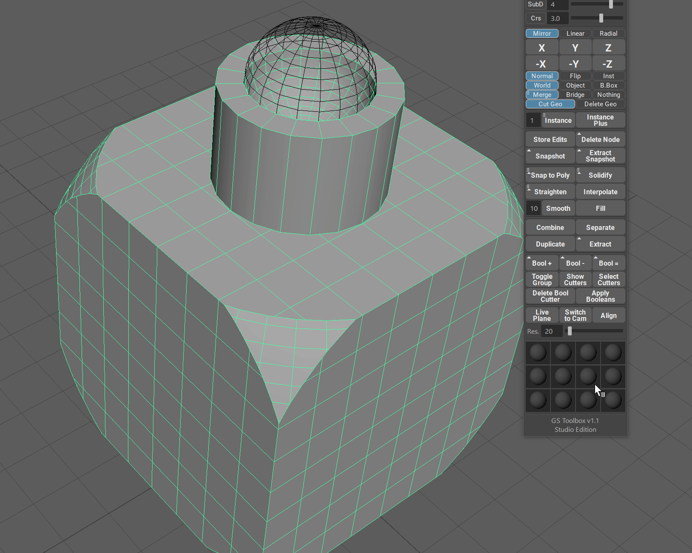

.. currentmodule:: <index>

########
Booleans
########

Intro
^^^^^

    
Booleans are an extremely powerful concepting and modeling tool that allows user to quickly iterate through different shapes and make quick cuts, combine objects etc.

In Maya, booleans are extremely limited. After applying boolean operation user can't change the original shape of the cutter or bypass it or even delete it.

GS Toolbox adds a special boolean menu that allows for editing, bypassing, changing the type of booleans and even deleting the cutters without loosing the original shape.

Boolean Menu
^^^^^^^^^^^^

    
In the boolean section of GS Toolbox you will find three boolean operations, Toggle Group, Show Cutters and Select Cutters as well as Delete Bool Cutter and Apply Booleans functions.

Note the small triangle on the boolean buttons. This means that there is an additional mode available for this button when pressing Shift modifier.

Boolean Operations
^^^^^^^^^^^^^^^^^^

When selecting objects for boolean operations it is important to remember the order of selection.

Ths First object is always the Boolean Base object. Base object is the object that you will add to or cut from using booleans.

All the objects selected after the first one will act as boolean "cutters". They are the objects that will be merged to the base object or that will cut from the base object.

.. note::
    First Selection -> Base Object

    Everything Else after that -> Boolean Cutters (Operands)

.. figure:: images/boolean_operations_demo.gif
	:class: with-shadow align-right
	:width: 300px
	:align: center

**Operations**

- **Bool+** - This operation will **combine** (add) two (or more) objects to the original shape.

- **Bool-** - This operation will **subtract** (cut) all the cutters from the base object.

- **Bool=** - This operation will create a new object that is based from an **intersection** between Base Object and Cutter objects.

Holding Shift when applying boolean operation will automatically hide the wireframe of the boolean cutter object after the boolean operation.

Boolean Attributes
^^^^^^^^^^^^^^^^^^

Every boolean cutter has its own attributes (in the Channel Box):

- **Boolean** - changing this attribute will activate or bypass the selected boolean cutter.
- **Boolean Operation** - changing this attribute will change the boolean operation on the selected boolean cutter.
- **Boolean Classification** - changing this attribute will change the boolean operation algorithm for one sided meshes.

    - **Edge** will treat the one sided meshes as if they have thickness. This way you can cut the object with one sided plane and no geometry will pass through this plane.
    - **Normal** will treat the one sided mesh as if it is infinitely thin sheet of paper, slicing the base geometry.

Show/Hide Boolean Objects
^^^^^^^^^^^^^^^^^^^^^^^^^

You can easily show/hide all the boolean objects that are attached to the selected base object.

Toggle Group will show/hide the entire boolean group, leaving only the base object visible.

Show Cutters will show all the cutter object if you happen to hide them manually (or by using Shift modifier during boolean operation)

Clicking on Select Cutters will simply select all the cutters attached to the selected base object.

Delete Boolean Cutter
^^^^^^^^^^^^^^^^^^^^^

It is possible to delete the selected cutter without any side effects.

Simply select the cutter object (wireframe) and click on Delete Bool Cutter button.

Applying Booleans
^^^^^^^^^^^^^^^^^

If you are satisfied with the boolean object you have created, you can simply click on Apply button and it will duplicate the final object and hide the boolean objects. You can then always return to them.

If you don't want anything left behind, simply select the boolean base object, hold Shift and click on Apply Booleans button. This will clean up the scene and leave you with a new geometry you have created.

Additional options
^^^^^^^^^^^^^^^^^^

In the options menu you can choose an option to group together applied booleans. This will result in the same behavior as normal Apply, but it will create a single group in the outliner and store the objects there.

.. _booleans-algorithms-ref:

Boolean Algorithms
^^^^^^^^^^^^^^^^^^

When selecting multiple cutters for the boolean operation, it is important to know that there are actually three distinct algorithms available for "multi-boolean" command.

You can find those algorithms in the Options menu, alongside with some other boolean options.

Three boolean algorithms:

- **Merged** - the fastest and "cheapest" algorithm. It will merge all the cutters together into one object before the boolean operation, resulting in faster boolean and sacrificing individual attributes for each object.

- **Optimized** (Default) - this algorithm will leave the objects separate, but it will use only one boolean operation on all of them. This results in relatively light boolean operation with the ability to edit/move individual objects, but sacrificing the individual bypass and operation change capabilities of the cutters

- **Advanced** - this algorithm is the slowest and will apply separate boolean operation for each of the selected boolean cutters. You get the full control and loose some performance this way.

**Other options:**

**Boolean Wireframe Output** will determine whether the output base object should be in wireframe or shaded mode. This is useful when using booleans with Instance+. This option will be automatically applied if Instance+ is detected.

**Automatic Boolean Instance Conversion** will automatically convert all the instanced objects to regular geometry if they are detected. Disabling this option will result in a pop-up each time the instanced object is detected.

