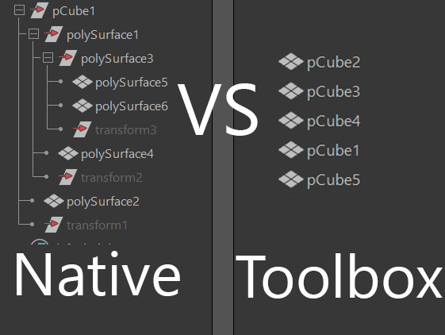
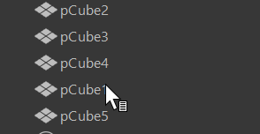
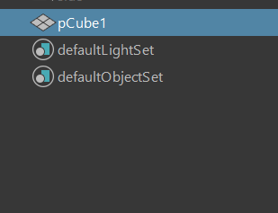
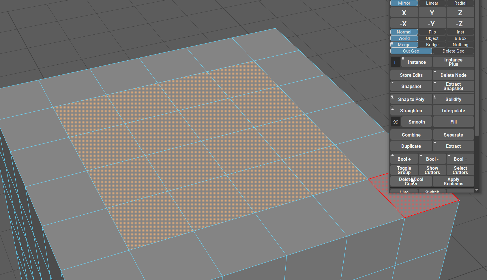
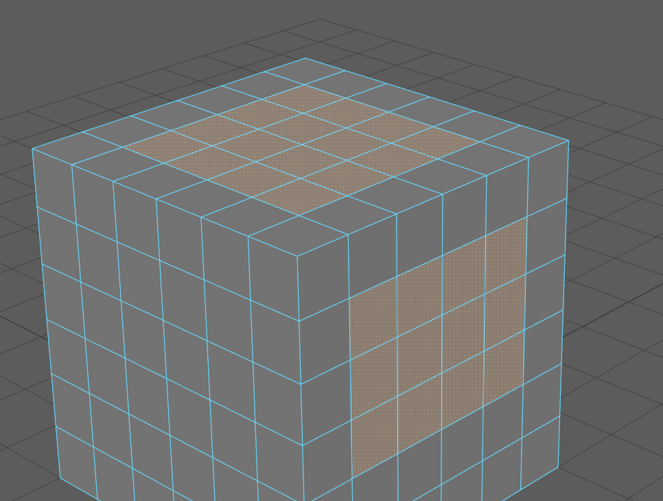

.. currentmodule:: <index>

########################################
Combine, Separate, Duplicate and Extract
########################################

Intro
^^^^^

Some functions in Maya are used extremely often and they tend to mess with the outliner grouping and organization.

Mayas Combine, Separate for objects and Extract and Duplicate for Faces leave behind a lot of unnecessary groups in the outliner and also they rename the objects you are using them on.

This can lead to confusion and give user a hard time looking for an object in the outliner.

GS Toolbox added those four functions that mimic Mayas own native ones, but they do not create groups and they try to keep the names of the objects intact.

In the example screenshot, you can see the same amount of Extract Face operations and the resulting outliner.

Combine
^^^^^^^

Combine operation will simply combine two or more selected objects together into one mesh.

It will not create any unnecessary groups and the name of the resulting object will be based on the name of the first selected object.

Separate
^^^^^^^^

Separate will separate the mesh into its shells (unconnected geometry).

It will not create any unnecessary groups and the name of the resulting object will be based on the name of the original object.

|

Duplicate
^^^^^^^^^

Duplicate will simply duplicate the selected faces leaving the original object intact.

The name of the new object(s) is based on the original object.

Duplicate will always separate objects.

Extract
^^^^^^^

Extract will extract the selected faces from the object.

By default it will only extract the faces, but it will not separate objects.

To automatically separate objects, Hold Shift before clicking on Separate button.

The name of the new object(s) is based on the original object.