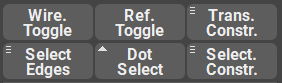

.. currentmodule:: <index>

#####################################
Constraints, Selection and Visibility
#####################################

Wireframe and Reference Toggle
^^^^^^^^^^^^^^^^^^^^^^^^^^^^^^

**Wireframe Toggle** button is used to quickly change the shading on the selected mesh.
This is extremely useful when you need to have only one transparent mesh in the scene.
This button is interactive and will change color if it detects that the wireframe mode is enabled.

**Reference Toggle** is a quick way to disable viewport selectability of the selected mesh. 
Sometimes you don't want to constantly select some meshes in the viewport and they are in the way. 
Or for example you want to quickly disable selectability of an image plane for your reference images.
This button is interactive and will change color if it detects that the wireframe mode is enabled.

Transform Constraint
^^^^^^^^^^^^^^^^^^^^

Transform Constraint button will toggle the constraints applied when moving geometry components.

This button has a marking menu (hold Right Mouse Button) where you can find two type of constraint available - Edge Constraint and Surface Constraint. 

|
|
|

Selection Constraint
^^^^^^^^^^^^^^^^^^^^

This constraint will toggle the **selection constraint based on the angle**, **based on the camera angle** or **both**.

**Select by Angle** option is very useful if you want to select a flat plane that has many polygons. With clicking on that constraint you can quickly select the entire flat plane of polygons. You can also change the angle tolerance for this selection (Default: 1 degree)

Selection based on camera angle (Auto-Camera Based Selection) will disable the selection of components that the current camera can't see. This is very useful if you want to quickly select some components using marquee tool, but don't want to accidenatlly select the other side of your model.

Angle + Auto Camera-Based selection will simply enable both of aforementioned options at the same time.

This button will change its color if constraint is currently active.

Dot Select
^^^^^^^^^^

**Dot Select** button will select the next component in a pattern that you select

**Shift + Dot Select** will select the entire loop based on the selection.

The pattern is based on the last two selected components.

It works on vertices, edges and faces.

Select Edges
^^^^^^^^^^^^

This button selects edges on the selected meshes based on the Angle slider value.

Multiple objects can be selected for this function.

It also have a marking menu (Hold RMB on this button):

- Select Border Edges will select the open border edges for the selected objects

- Select N-Gons will select all the N-gon faces on the selected meshes.

- Select Hard Edges will select only hard edges on the mesh, ignoring Border Edges.

