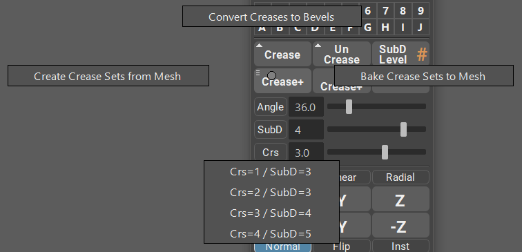

.. currentmodule:: <index>

#####################
Creasing and Beveling
#####################

Intro
^^^^^

Creasing and Beveling is a powerful and non-destructive way to create SubD geometry. It works by applying a creasing value (creasing parameter) to the edges and this parameter controls at which subdivision this edge will start to smooth.

|

.. figure:: images/creasing_subd_levels_example.gif
	:class: with-shadow align-right
	:width: 250px
	:align: center

For example: If you apply a creasing value of 2 to the edge, then this edge will not smooth until you reach a subdivision level of 3 or more. See how the edge is shart up until the level 3?

By default, Maya has a very convoluted and non-intuitive creasing workflow. You can't crease by angle and there is a separate hidden menu for the creasing controls. Applying creases is a pain as well, as you need to select the creasing tool first and then drag middle mouse button. There is no way easily set a desired creasing value, you can't crease faces etc.

GS Toolbox aims to fix all of those issues.

In the Creasing Menu you have six buttons, three sliders and three additional toggles for interactive edge highlight, SubD change and Creasing.

You can crease individual edges, crease by angle, bevel by angle and un-crease selected or all edges.

Creasing Individual Edges
^^^^^^^^^^^^^^^^^^^^^^^^^

In order to crease individual edges all you need to do is to select the edges and click on "Crease" button. Crease button will look at the Crs slider and set the crease level that is selected there.

Crease button also supports face selection. In face selection there are two modes. Normal click will by default crease only the perimeter of the selected faces. Shift + Crease will crease all the edges in the selected faces. This functionality can be adjusted in the Options menu.

Un-Crease button will remove creases on the selected edges. Face selection follows the same pattern as the Crease button.

Interactive Edge Creasing
^^^^^^^^^^^^^^^^^^^^^^^^^

You can enable interactive creasing mode by clicking on Crs button near the Crs slider. 

After you enabled this mode, selecting edge or faces and dragging the slider will result in an interactive creasing of the said edges or faces. 

The slider will change its value based on the selected edge.

Face selection follows the same rules as the Crease button.

Clicking on SubD button will change the slider to an interactive SubD slider. Dragging this slider will apply different SubD levels to the mesh.

Interactive Edge Highlight
^^^^^^^^^^^^^^^^^^^^^^^^^^

.. figure:: images/angle_highlight_example.gif
	:class: with-shadow align-right
	:width: 300px
	:align: center

Interactive edge highlight will highlight the edges based on the Angle slider angle tolerance.

To activate this mode select the object (or multiple objects) and click on a small "Angle" button on the left from the Angle Slider.

In this mode, dragging the slider will interactively filter the edges based on the selected Angle tolerance.

Note how some of the edges are now different color (this color can be changed in the Options menu). Those colored edges are the edges that will be affected by the next command you choose.

Note how 3 buttons are now highlighted - Select Edges, Crease+ and Bevel+. This means that you can finish the selection process by selecting one of those functions.

Selecting "Select Edges" will finish the interactive mode and select the edges you have highlighted.

.. note:: You don't have to enter the Interactive Angle Highlight mode to use Select Edges, Crease+ and Bevel+. Simply dialing the Angle, SubD and Crs values and clicking on any of those buttons will result in the same selection.

Creasing and Beveling by Angle
^^^^^^^^^^^^^^^^^^^^^^^^^^^^^^

Creasing and Beveling by Angle can be performed in the same way you've Selected Edges in the Interactive Edge Highlight mode. Select objects, click on Angle button, drag the slider and finish the selection with Crease+ or Bevel+.

Crease+ will look at the SubD and Crs slider values and apply them to the mesh and edges based on the Angle Tolerance you've selected.

In the Marking Menu for Crease+ button you can also find several crease presets that you can use. They will change the SubD and Crs slider values.

Bevel+ will look at the SubD and Angle Tolerance only, and apply bevel to those edges that are highlighted or fall within the Angle Tolerance numbers.

Un-Crease+ button will remove all the creases on the selected mesh.

Convert Creases to Bevels
^^^^^^^^^^^^^^^^^^^^^^^^^

You can easily convert already creased edges to bevels by using Convert Creases to Bevels command under the Crease+ marking menu (Hold RMB on Crease+ button).

Selecting Convert Creases to Bevels will look at all the creased edges on the object and change them to bevels. Crease value on the edge will have no effect on the final bevel as Maya does not support variable bevels on one Bevel node.

Create Crease Sets and Bake them
^^^^^^^^^^^^^^^^^^^^^^^^^^^^^^^^

You can always edit and select already creased edges by simply creating a selection set from them.

This can be done by accessing Crease+ marking menu (Hold RMB on Crease+ button) and selecting "Create Crease Sets from Mesh". This will create a selection set based on the creases. Different crease values will result in a different selection set, so you can easily distinguish between them.

Crease sets will have format "Mesh Name + _creaseSet#"

To select edges from any of the sets, just right click on the set and click "Select Set Members". You can now edit selected edges with Crease button and different Crs value.

Bevel+ Marking Menu Options
^^^^^^^^^^^^^^^^^^^^^^^^^^^

You can access Bevel+ marking menu by Holding RMB on Bevel+ button. Here you will find Chamfer toggle and Default Segments selection.

Chamfer toggle will enable and disable rounding of the edges you are beveling.

Default Segments will change the amount of segments that your initial bevel will have (can be always changed during the beveling process).

Additional buttons
^^^^^^^^^^^^^^^^^^

SubD Level button shows you the current Subdivision level of the selected mesh and clicking on this button will apply the SubD level set on the SubD slider.

