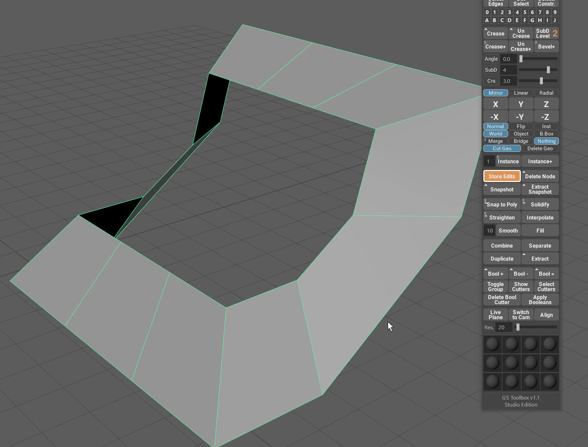

.. currentmodule:: <index>

#############
Fill Function
#############

Intro
=====

Filling an open border (hole) in the mesh during modeling is one of the most annoying and time consuming tasks out there. If you wish to have a regularly spaced quads for further modeling, this task can take up to several minutes to complete. Filling a hole, cutting it with cut tool or even just bridging - it takes time.

Fill (Fill Hole) function in GS Toolbox tries to solve this issue with one click.

It works on rounded, curved and other complex surfaces.

The only limitation - you need to have an even amount of verts around the border for this to work.

The patch that is being created is welded to the object and is a part of it.

.. warning:: Due to complexity of the operation, the history on the object you are trying to fill will be deleted.

One Vertex Fill (Automatic)
===========================

The most basic task that can take too much of your time is creating a quadded cap on the open end of the cylinder. Some modelers even create special cylinders with quadded caps and then just import them when they are needed.

GS Toolbox Fill will solve this task in one click.

Simply select one vert on an open edge of a cylinder and click "Fill".

The vert you select will determine the corner quad of the cap. By selecting different verts, you can rotate this cap to the orientation you want.

When you are filling irregular patches with quads, you can also select only one vert and Fill algorithm will try to fill the hole with even quads.

Two Vertex Fill (Custom Corners)
================================

You can also select two verts on an open border and this way the algorithm will know where to put the first two corners of the quad patch.

Selecting two verts can result in a more predictable quad pattern and usually recommended.

Example 01 - Curved Polygon Strip
=================================

Here is a more complex example - curved surface with an opening.

In this case we want very specific pattern of quads to complete this shape.

We select two bottom corners of the shape, to show the algorithm where the first two corners should be.

You can select other corners this way as well, just remember that those corners should be next to each other.

Example 02 - Cube with Holes
============================

In this example we have a cube that has two holes in it. One of those holes curves around the corner of the cube.

Just like in the previous example, we want to show the algorithm where to put the first two corners and then click Fill.

This will complete the shape and you will have equally spaced quads to continue modeling.

Example 03 - Curved Detail Surface
==================================

In this example we have simple curved detail that has an opening that we want to fill.

It's a perfect example where we need to select two corner verts for the algorithm to recognize and fill the pattern correctly.

|
|

Custom Patterns Fill
====================

Custom patterns is a very powerful feature that allows to have different patterns of quads on the mesh based on the two vert selection.

There are always more than one way to fill an open border. Some of them work, some of them will result in a warning message and some of them will simply not fill the way you like. Experiment.

Example 04 - Cut Cylinder
=========================

In this example we are selecting two different patterns of verts. 

The first pattern will complete the cylinder shape.

The second pattern will create an interesting detail based on the cut part of the cylinder.

There are more patterns you can use in this case.

Example 05 - Sphere with Hole
=============================

In this example we have a sphere that is incomplete.

We can either fill it with quads in a pattern that will try to mimic the curved surface of the sphere (although, not perfectly) or we can have a more creative approach.

If you select the corners in a normal way you will simply complete the shape and that's it.

|

If you try other vert combinations, you can discover some very interesting patterns that can be a surface detail on their own.

