.. currentmodule:: <index>

###########
First Steps
###########

Intro
=====

The main function of GS Toolbox is to speed up hard surface workflows in Maya. Main functions that you are going to use are:

- Select, Crease and Bevel by Angle
- Mirroring and Instancing
- Booleans
- Arrays
- Utility functions such as Fill, Straighten, Combine etc.

In this chapter we are going to briefly discuss all of those functions. For more in-depth and advanced explanations please refer to the appropriate chapter in table of contents on the left.

Quick Intro to Creasing Workflow
================================

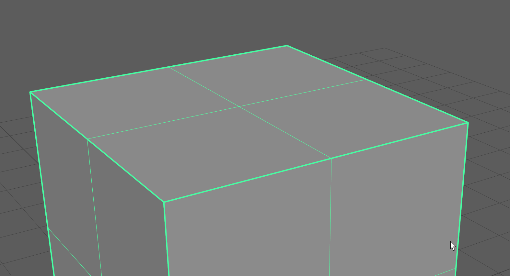

Creasing is a powerful and non-destructive workflow in Maya. Creasing an edge applies a crease parameter to that edge and whenever you smooth the mesh, this edge will remain sharp based on that parameter. For example, crease level of 2 will remain sharp on subdivisions 1 and 2, but when you go to subdivision 3 you will notice that creased edges is now smoothed uniformly.

However, the native way of applying and managing creases is very slow and cumbersome. You can't apply creases based on the angle, you can't apply fixed values of creases easily and native creasing tool is slow.

GS Toolbox provides with convenient functions to Select, Crease+ or even Bevel+ edges based on the angle between faces. This allows for some very quick creasing, especially since a lot of hard surface models have very sharp corners.

You can also crease individual edges by a fixed amount just by clicking on the Crease button.

Interactive Edge Selection and Crease
=====================================

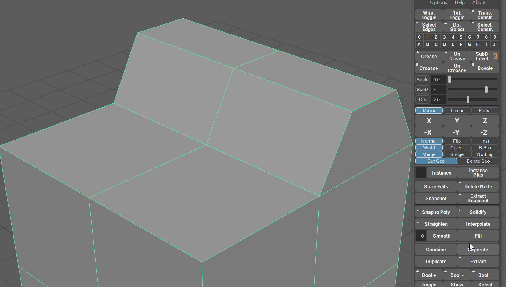

To start interactive selection, select an object(s), click on the small "Angle" button near the slider that controls the angle parameter and start dragging the slider. You will notice how the highlighted edges change based on the angle you select.

|

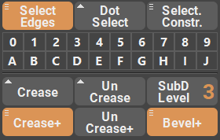

Notice how three buttons are now highlighted - Select Edges, Crease+ and Bevel+. This indicates that you can now finish your angle selection by either simply selecting the edges that were highlighted or by applying Crease or Bevel to those edges.

|
|

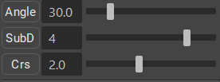

Crease+ function will be applied based on the parameters of SubD and Crs sliders, where SubD is the subdivision level of the mesh and Crs is the crease level on the creased edges.

|

.. note:: You don't have to use interactive selection every time and even without it pressing any of the aforementioned buttons will result in the same selection or creasing.

Quick Mirroring and Instancing
==============================

Mirroring is an essential part of any hard surface model. Even if the final model is not completely symmetrical, mirroring is still used to quickly add geometry on the other side of the model and edit it accordingly.

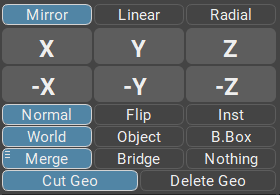

In GS Toolbox you will find all the mirroring tools you might need in one convenient menu. This menu is interactive and changes based on the selected mirror, flip, instance or delete parameters. 

**X, Y, Z** and their negative counterparts represent the axis of mirroring. 

Parameters control the type of operation - **Normal mirror, Flip, Instance or Deletion**. 

**World, Object and B.Box** control the coordinates system, with World being the world coordinates, object is pivot based and B.Box is bounding box based.

**Merge, Bridge and Nothing** control the boundary options for the Normal Mirror. They determine what happens with the open border of the mesh when the mirror operation is performed.

If the **Cut Geo** parameter is selected it will cut the geometry based on the mirror plane.

**Delete Geo** will delete one side of the geometry based on the mirror plane.

Quick Booleans
==============

Booleans is a powerful concepting and modeling tool that is severely underrepresented in Maya. You can't edit already applied booleans, edit original geometry and even simply moving the cutter can be annoying. 

With Quick Booleans GS Toolbox aims to fix those problems.

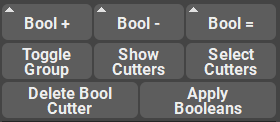

With **Quick Booleans** you can:

- **Addition, Subtraction and Intersection** operations
- **Edit the original geometry** on the fly
- **Toggle cutter visibility**
- **Quickly select** cutters
- **Delete any selected cutter** without loosing other procedural booleans. 
- **Apply booleans** with one button

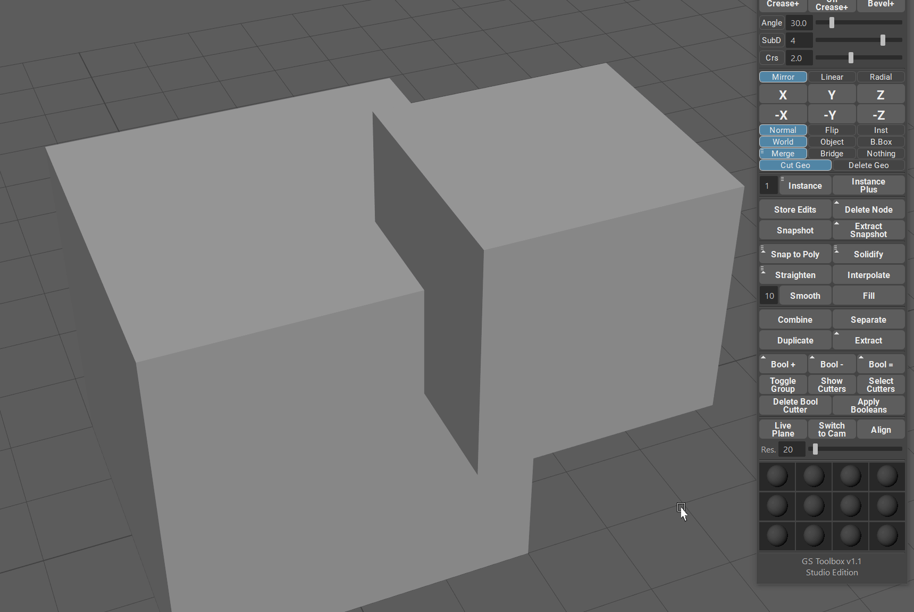

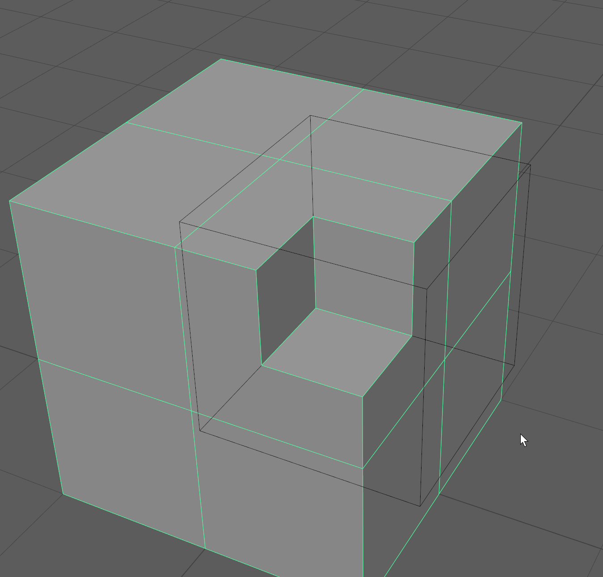

|

Arrays
======

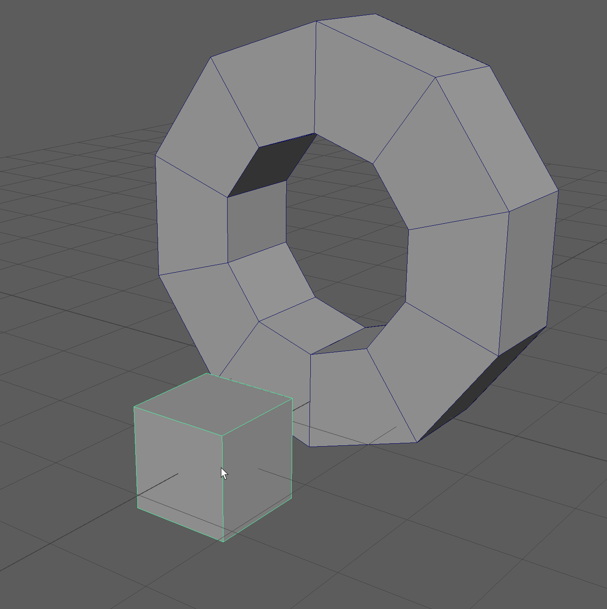

GS Toolbox can quickly generate different types of arrays that will help with the modeling of complex shapes like pipes, chains, wheels etc.

Arrays are dynamic and the edits to the original object will update the array automatically.

Linear arrays can be generated on the default curve on any number of selected target curves.

All the arrays have separate controls accessible from the Array Control Window.

More on arrays here: :ref:`Arrays <arrays_page>`

Utility Functions
=================

There are a bunch of utility functions available.

**Straighten** will straighten any selected edges and edge groups (not connected edges):

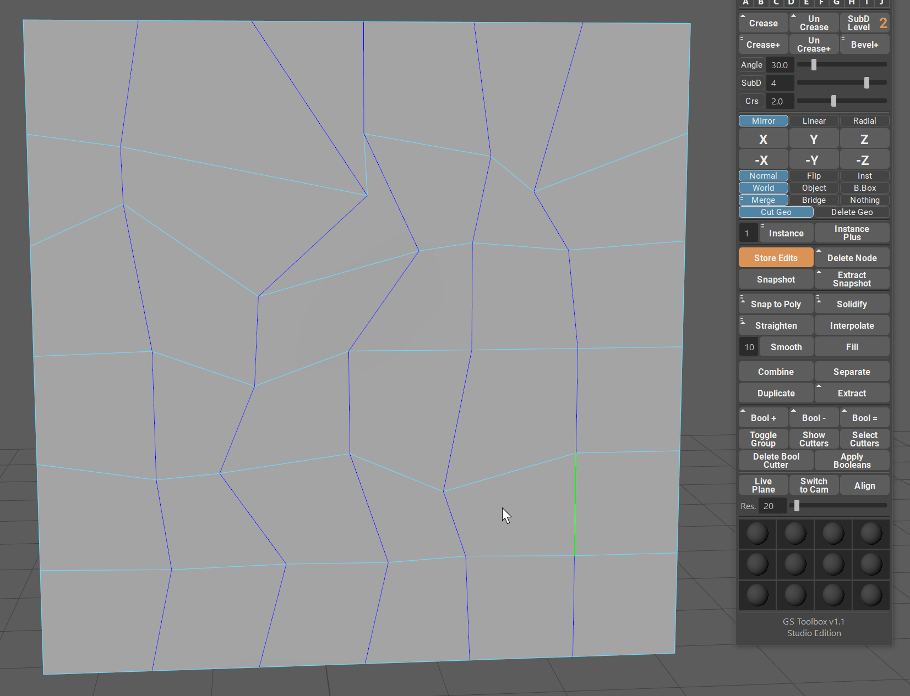

**Interpolate** will interpolate selected edge groups between first, middle and last vert:

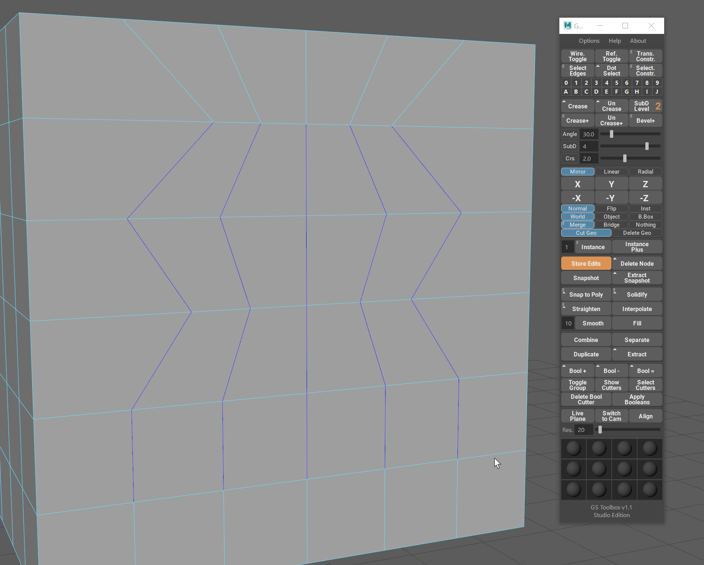

**Smooth** will smooth the selected edges based on the smoothing multiplier:

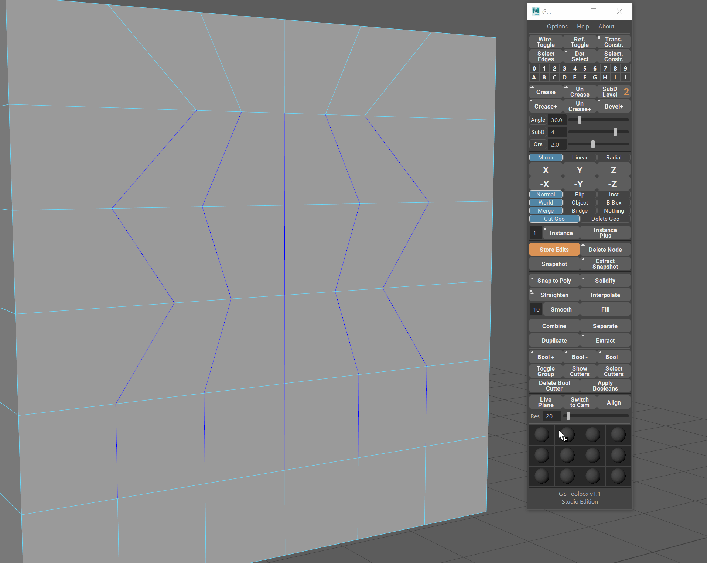

**Combine, Separate, Duplicate and Extract** are all similar to Maya native functions but they will not clutter the outliner with an unnecessary groups and will not rename objects.

.. note:: This is just a small introduction to the main functions of this plug-in. For more info, please refer to the Table of Contents.
