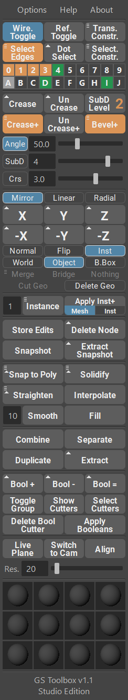

#############################################
GS Toolbox for Autodesk Maya Documentation
#############################################

**For Maya 2017-2020**

Links
^^^^^

- `Online Store <https://sladkovsky3d.artstation.com/store>`_
- `Discord Support Server <https://discord.gg/KyPCW6F>`_
- `Twitch Channel <https://www.twitch.tv/videonomad>`_
- `YouTube Channel <https://www.youtube.com/GeorgeSladkovsky>`_
- `ArtStation <https://www.artstation.com/sladkovsky3d>`_

Introduction
^^^^^^^^^^^^

**GS Toolbox** is a powerful hard-surface and general purpose modeling plug-in for Maya that adds a lot of useful new features, as well as expands and simplifies already existing Maya functions.

This plug-in uses an intuitive and interactive menu that changes depending on the currently used function. For example, going into **edge selection mode** (angle button) highlights **"Select Edge"**, **"Crease+"** and **"Bevel+"** button to indicate that you can finish the selection with one of those functions.

The main power of GS Toolbox is the **speed** of its functions and the ability to **quickly apply any function from one menu** without opening windows and changing options.

One of the main focuses of GS Toolbox is **hard-surface modeling and creasing workflow**. Using creases as an addition to control loops allows for very powerful and non-destructive workflow for high-poly modeling. Creases can then be easily converted to bevels to decrease the number of subdivision required for the smooth and perfect surface.

Another powerful feature is **quick Mirroring and Instancing with Mirror**. Maya does not have procedural modifiers, so instancing is heavily used for this purpose. GS Toolbox have thee modes of mirroring that can be used on multiple objects and activated using only one button - mirror, flip and instance. Instance will mirror-instantiate the object..

**Procedural Mirroring and Instances with Boolean Support** - using new Instance+ option you can now apply procedural Mirroring and use Booleans with Mirroring.

**Filling the opening** in geometry with quads is another fast and useful feature. Sometimes it is very hard and time-consuming to bridge the opening in the geometry and cut it in even quads. With "Fill" function you can select only one vert from the border and click one button for instant even-quadded fill. Works on flat, curved and other irregular surfaces.

Main Features of GS Toolbox
^^^^^^^^^^^^^^^^^^^^^^^^^^^

- **Powerful and interactive menu** with high-DPI support.
- Quick access to **Transform and Selection constraints**.
- **Dot Select** Quads, Edges and Verts to quickly select patterns.
- 20 powerful and easy to use **selection sets**.
- Quickly **Select Edges by Angle** between faces.
- Interactively **Crease and Bevel** the geometry based on the Angle between faces.
- **Crease** individual edges and faces selection with one click.
- **Powerful mirroring menu** with support for multiple objects, interactive options and six axis buttons for quick mirror:

    - **Normal mirroring** (World, Object and Bounding Box)
    - **Flip Geometry** (World, Object and Bounding Box)
    - **Instance and Mirror** (World, Object and Bounding Box)
    - **Delete by Axis**. Cuts the geometry and deletes based on the selected axis.

- **Quick Instance with duplication** to add multiple instances with one click
- **New Instance+** function with support for booleans, procedural mirror modifier and solidify modifier (extrude).
- **Solidify** is a better version of Extrude that is compatible with Instance+
- Create **quick snapshots** of the geometry with history to save them it you wish to modify them later and delete the history of the current object.
- **Snap to Poly** to move and orient an object to one or multiple selected faces. Instance and Snap will also instantiate the object and snap those instances on the selected faces.

- **Randomize Transforms** (under the Instance button) to interactively randomize Transformation, Rotation and Scale of multiple selected objects.
- **Straighten** will straighten any edge selection to a straight line. Shift + Straighten will also equalize vertices along this line.
- **Interpolate** will smoothly interpolate selected edges based on the first, middle and last vert in the selected edges.
- **Smooth** will smooth the selected edges based on the smoothing multiplier.
- **Fill** will fill any selected hole quads. Selecting two verts instead of one will result in a different pattern of quads, depending on the combination of selected verts.
- **Combine and Separate** is a clean way to combine and separate geometry without any additional groups in the outliner. The naming of the original object will also be respected.
- **Duplicate and Extract** will duplicate or extract selected faces in a clean way, without unnecessary groups in the outliner. It also keeps the history of the original object intact.

- Powerful **procedural Booleans** with the ability to edit already applied booleans, delete boolean component objects and quickly apply booleans.
- **Live Plane** will place a Live Plane on the selected face. You can switch to the **custom camera** that follows this Live Plane and also align any object to that plane, using **Align**. Res. slider will change the subdivision of this live plane.
- **12 Quick Material Slots** are powerful and easy to use material management tool that can store and load presets and apply Global Materials.

Supported Platforms
^^^^^^^^^^^^^^^^^^^

**Maya 2017-2020 for Windows** -> Fully Tested and Supported.

**Maya 2017-2020 for Mac** -> In Beta.

**Linux** -> Not Tested and Not Supported.

**Maya LT** -> Not Tested and Not Supported.

.. toctree::
    :maxdepth: 2
    :caption: Table of Contents:

    Home <index>
    Changelog <changelog>
    Video Tutorials <video-tutorials>
    Installation <installation>
    First Steps <first-steps>
    Constraints and Selection <constraints-and-selection>
    Selection Groups <selection-groups>
    Creasing and Beveling <creasing-and-beveling>
    Mirroring and Instancing <mirroring-and-instancing>
    Linear and Radial Arrays <linear-and-radial-arrays>
    Instance and Instance+ <instance-and-instance-plus>
    Store Edits and Delete Node <store-edits-and-delete-node>