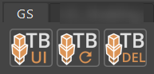

.. currentmodule:: <index>

########################################
Installation, Shelf, Hotkeys and Updates
########################################

Installation Steps
^^^^^^^^^^^^^^^^^^

.. warning:: Only **Windows** version is **fully supported**. **Mac** version is currently in **beta test** and may have some bugs. **Linux** was not tested and currently **not supported**. **Maya LT** was not tested and currently **not supported**.

#. Unpack and copy **gs_toolbox** folder to:

	- **Windows:** Documents/Maya/{Maya_Version}/scripts/
	- **Mac:** {Your_Mac_Name}/⁨Users⁩/{User_Name}/⁨Library/⁨Preferences⁩/⁨Autodesk⁩/⁨maya/{Maya_Version}/scripts/⁩

    .. figure:: images/windows_folder_structure_example.png
        :alt: Windows Folder Structure Example
        :class: with-shadow
        :width: 600px
        :align: center

        Windows Folder Structure Example

    .. figure:: images/mac_folder_structure_example.png
        :alt: Mac Folder Structure Example
        :class: with-shadow
        :width: 600px
        :align: center

        Mac Folder Structure Example

#. Run **Maya**

#. Copy and Paste this code to **Python Command Field** at the bottom (switch from MEL by clicking on it) or to the script editor:

    .. code-block:: python

        import gs_toolbox.init as tb_init;from imp import reload;reload(tb_init);tb_init.Init();

#. **Run the code** (Press Enter for the Command Field or press on triangle for script editor). Installation is complete.

.. figure:: https://i.imgur.com/fUdzdWO.png
	:alt: Script Editor Example
	:class: with-shadow
	:width: 300px
	:align: center

Main Menu, Resetting and Stopping
^^^^^^^^^^^^^^^^^^^^^^^^^^^^^^^^^

After `Installation Steps`_ **GS** tab will appear on **Maya Shelf**.

TB UI button will open/close GS Toolbox User Interface.

TB Reset will reset GS Toolbox to its default state.

TB Del will close GS Toolbox UI and stop any background scripts.

.. note:: You can use middle mouse drag to drag these buttons to any tab on the shelf.

Hotkeys
^^^^^^^

After you Initialize_ the plug-in you can find all the hotkeys in::

    Hotkey Editor -> Custom Scripts -> GS -> GS_Toolbox

.. _Initialize: `Installation Steps`_

Updating the Plug-in
^^^^^^^^^^^^^^^^^^^^

To update the plug-in to a new version just **delete** the old **gs_toolbox** folder and repeat the `Installation Steps`_.