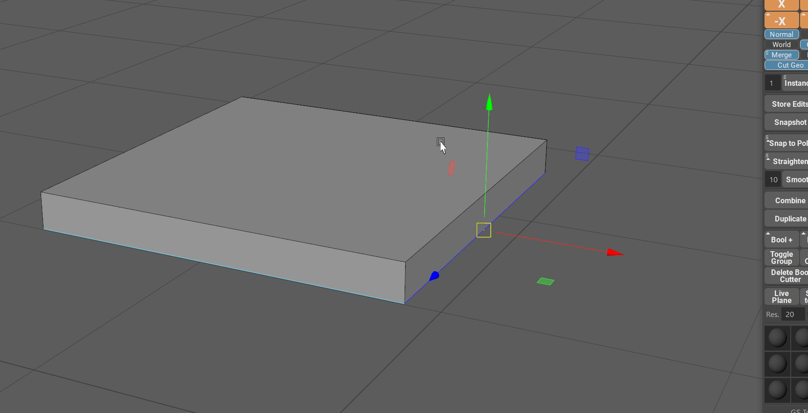

.. currentmodule:: <index>

######################
Instance and Instance+
######################

Intro
^^^^^

Instancing is a process of duplicating the geometry and keeping the reference to the original shape. 

Editing any instanced object will result in the same edit across all other instances.

This can be a powerful way to populate a scene with repeating geometry without the need to duplicate them every time you need to make a change.

.. note:: Do not confuse Instance and Instance+ with :ref:`mirroring-and-instancing`.

In Maya instancing is quite prominent tool since there are almost no procedural modifiers available for the user.

GS Toolbox provide with a fast and easy way to use classic instancing (Instance button) and also there is a brand new instance mode available - Instance+.

Instance
^^^^^^^^

Instance button and associated to it input field will create the amount of instances dictated by said input filed.

Simply clicking on Instance button will create the instances in the X+ direction with the center based on the current position of the original object.

There are multiple options available for the Instance. You can access them via Marking Menu (Hold RMB):

- X,Y,Z,-X,-Y,-Z buttons will create the instances aligned to one of those axes.
- Instance, Copy and Copy with History options:
    - Instance will create default instances.
    - Copy will copy the selected object without Construction History.
    - Copy with History will copy the selected object with Construction History.
- No Offset, Offset, Offset + Gap options:
    - No Offset will simply instantiate (or copy) selected objects and will not move them.
    - Offset will apply an offset to the object equal to the object's bounding box. You can manually increase/decrease this offset by using offset menu and value (square button on the right of Offset options)
    - Offset + Gap will offset the object the same way regular offset does but it will also add a small gap between each object. This can be helpful when selecting multiple objects after instantiation.
- Randomize Transforms will open a window where you can find various controls for Transformation, Rotation and Scale randomization of the selected objects.

Randomize Transform Window
^^^^^^^^^^^^^^^^^^^^^^^^^^

You can fine Randomize Transform Window in the Instance Marking Menu (Hold RMB).

This window allows for quick randomization of the selected objects with preview.

Start by selecting the objects you wish to randomize.

Enable the randomization modules you wish to use and relevant axes.

Start dragging the sliders to see the randomization preview in the viewport.

When you are happy with the randomization simply click on Randomize button to apply the randomization parameters to the objects.

Instance+
^^^^^^^^^

Maya is a powerful 3D editing software, however, it misses one very important tool - procedural modifiers like Mirror. Also, Mayas instancing does not support booleans and breaks every time you try to use them.

GS Toolbox managed to partially solve some of these issues with Instance+.

Instance+ will create an instance of an object, similar to regular instance, but you can actually apply various modifier to it - Mirror, Solidify and Booleans.

Selecting an object and clicking on the Instance+ will initialize Instance+.

Notice how the button changes from Instance+ to Apply Inst+ with two options "Mesh and Inst".

If you then try to switch from Mesh to Inst option, some of the buttons in GS Toolbox will light up.

Clicking on Apply Inst+ will then apply instance+ and you will have a normal, editable object in the scene.

So lets dive deeper into instance+ capabilities.

First of all let's talk about Mirror and Solidify.

Mirror and Solidify Modifiers for Instance+
^^^^^^^^^^^^^^^^^^^^^^^^^^^^^^^^^^^^^^^^^^^

You can apply procedural mirror modifier to Instance+.

Editing the geometry will then mirror the edit to the other side procedurally, without then need to reapply the mirror command each time.

In order to apply the mirrors to Instance+, simply select the object, switch to Inst mode in instance+ button and click on one or multiple highlighted axes of the mirror section.

.. figure:: images/instance_plus_multi_mirror.gif
	:class: with-shadow align-right
	:width: 250px
	:align: center

Mirroring supports multiple axes of mirroring at the same time, so you can apply multiple mirrors to one Instance+.

For example, editing one corner of the cube will be mirrored to all the corners of said cube.

You can also add procedural Extrude (Solidify) modifier to Instance+. Using this modifier is similar to normal Extrude, but it will insure the compatibility with Instance+ mesh.

Simply apply Instance+, switch to Inst mode and click on the highlighted Solidify Modifier.

For example, using Instance+ with Solidify modifier on a plane will create a procedural plane with thickness that can be extruded using only one edge for ease of editing.

|
|

Booleans and Instance+
^^^^^^^^^^^^^^^^^^^^^^

You can use GS Toolbox Booleans with Instance+ (for more info about Boolean system, visit Booleans section).

This is not possible with regular instanced geometry in Maya.

This method is especially powerful in conjunction with Mirror modifier applied to Instance+ beforehand.

.. warning:: Very large instance+ meshes and a lot of booleans on them can cause Maya to slow down and in rare cases even crash. This is not related to the plug-in and is a problem with Boolean Node and Maya itself.

.. note:: Please note that Instance+ with Booleans is not a native Maya way of handling mesh data and can sometimes cause unexpected behavior. Please always backup your scenes before using Instance+ with booleans.