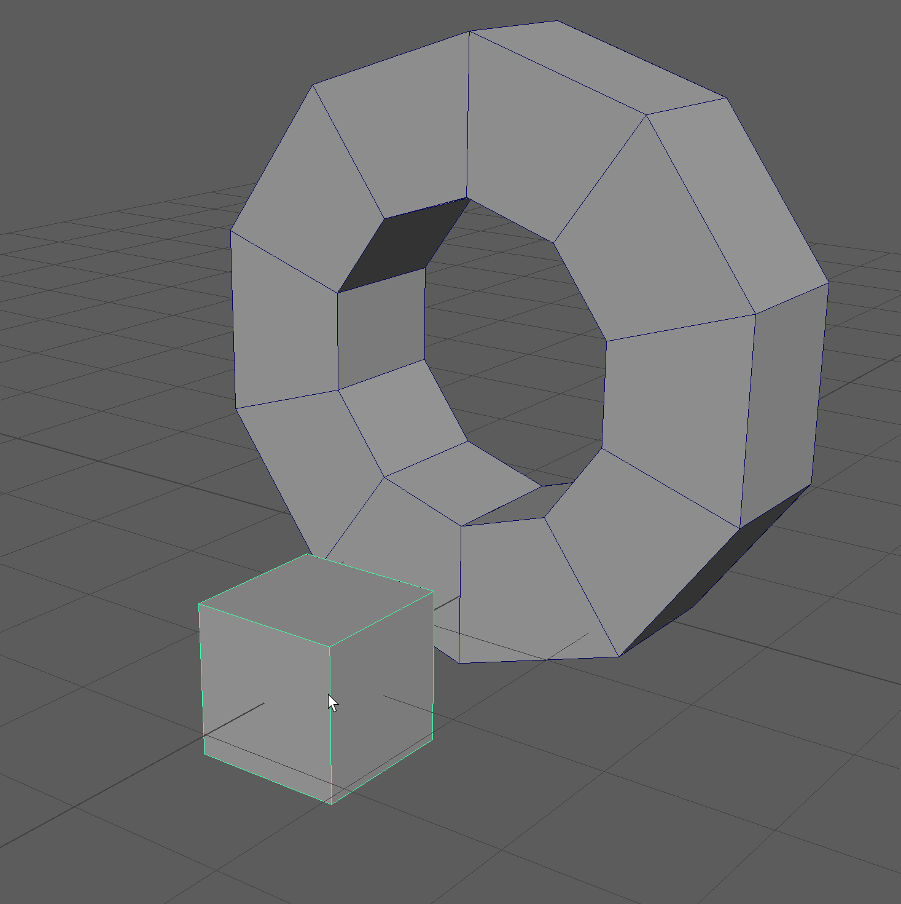

.. currentmodule:: <index>

########################
Linear and Radial Arrays
########################

.. _arrays_page:

Intro
=====

.. figure:: images/linear_and_radial_array_menus.gif
    :class: align-right
    :width: 200px

**Arraying** is a vital part of any 3D package. It allows for a quick and non-destructive creation of repeating parts and details.

In Maya, arraying is only available through a built-in plug-in package - MASH. Although it is very powerful Motion Graphics tool, MASH is not very user-friendly when it comes to modeling workflows.

In GS Toolbox there are two types of Arrays with 2 modes each. They utilize MASH in the background, but simplify and streamline the workflow focusing on a modeling side of arraying.

Two types of arrays are:

- **Linear Array** that has 2 modes:

    - **Uniform** array that provides with uniform and non deformable way of copying geometry
    - **Deformed** array that provides with an array that can be deformed using provided controls

- **Radial Array** that has 2 modes:

    - **Uniform** Array that creates a radial pattern without deforming the original geometry
    - **Deformed** Array that creates a radial pattern and deforms the original geometry.

.. note:: Linear arrays can also be applied to already existing curves and will follow their path. It is done by selecting the object(s) and the curve before clicking on any axis button.

.. note:: Due to the way **MASH** and **Python** interact in earlier versions of Maya, if you wish to **undo** an array you have to press **Ctrl+Z** not once, but **a few times** until you return back you your **original object (it should be highlighted)**

Main Window Controls
====================

In the main window there are the array type selector buttons (Linear, Radial, Uniform, Deformed), array initial axis (X,Y,Z...), add or remove from array buttons (+ and -), basic controls (Rotation, Original, Copies) and finally Apply Array and Control Window buttons.

Creating arrays
---------------

Creating Arrays is very simple. Select a mesh and click one of the axis buttons (X,Y,Z,XY,etc.) to initialize the array.

Linear arrays will always have a control curve that can be used to deform it further.

Custom curve can also be selected along with the geometry and that custom curve will be used instead of the default one. Any axis button can be used if the custom curve is selected.

Any number of target curves can be selected for the linear array creation. Each curve will have a copy of the array attached to it after the function is completed.

Adding or removing objects
--------------------------

You can add additional objects to the array or remove existing ones using + and - buttons. More :ref:`here<arraying-multiple-objects>`.

- **To add:** select the object, select the array mesh and press Plus (+) to add that object to the array.

- **To remove:** select the original object (the one you use to modify the array shape) and press Minus (-) to remove it.

Basic array controls
--------------------

- **Rotation** will toggle the rotation calculation for the arrays. This will rotate the array components with the curve (or circle) aligning them to the shape.

- **Original** will toggle the original mesh visibility. This mesh is lined to the array shape and can be used to modify the array dynamically.

- **Copies** will change the number of copies on the selected array object.

Array Control Window
====================

All the array types can be controlled from a single window - Array Control Window.

The sections and sliders will update based on the user selection.

Compatible selections are - array mesh or array control curve.

Sliders will update in real time during selection change.

Array Control Window sections
-----------------------------

.. figure:: images/array_control_window.png
    :class: align-right
    :width: 250px

- **Main Controls** - holds shared controls for all the array types, such as Show Original toggle and Copies Slider.
- **Linear-Uniform, Linear-Deformed, Radial-Uniform and Radial-Deformed** sections will show the specific controls for those array types.
- **Multi-Array Controls** - this section controls the multi-array behavior. Multi-array is enabled when multiple objects are added to the array (initial or using + and - buttons).
- **Array Randomization** - this section holds all the randomization controls for all of the array types.

|

Main Controls
=============

These controls are shared between all array types:

- **Show Original** toggle - will show or hide the original mesh.
- **Copies** slider - controls the amount of arrayed copies.

Linear-Uniform Array
====================

.. figure:: images/linear_array_basic_creation.gif
    :class: align-right
    :width: 250px

Linear array creates repeating copies of the selected object in line based on the selected axis (X,Y,Z).

|
|
|
|
|

.. figure:: images/changing_linear_array_copies.gif
    :class: align-right
    :width: 250px

The created array object is fully procedural and you can quickly change the number of the copies by selecting the arrayed mesh and dragging the "Copies" slider in the Main Window or click on Control Window to open advanced options.

|
|
|
|

.. figure:: images/modifying_simple_array.gif
    :class: align-right
    :width: 250px

Original object that you've arrayed is still there, can be edited using Maya tools and the changes you make will reflect on the arrayed objects.

|
|
|
|
|
|
|

.. figure:: images/linear_array_control_curve.gif
    :class: align-right
    :width: 250px

Every linear array you create has a control curve that can be modified and the array will follow that path curve.

You can easily control the array using this curve and even change the shape of that curve to change the path of the array accordingly.

Enabling or disabling the Rotation toggle will change the alignment of the mesh to that path curve. Disabled Rotation toggle will ignore the curve orientation and keep the original orientation of the mesh intact.

Linear-Uniform Array Attributes
-------------------------------

The **basic attributes** you have for the array are:

- **Calculate Rotation** enables or disables rotation calculation for the array to follow the control curve.
- **Stretch Along Curve** will determine how much the array should stretch along the length of the curve, where:

    - 0 (zero) is when all the arrayed objects are in the same location at the beginning of the curve.
    - 1 (one) is when all of the arrayed objects are uniformly stretched along the curve with equal spacing.

- **Offset Along Curve** will offset the geometry along the path curve based on the amount
- **Start** will determine the start point of the array on the curve. Similar to offset, but end point will not be moved.

Linear-Deformed Array
=====================

.. figure:: images/linear_deformed_array.gif
    :class: align-right
    :width: 250px

This type of array is very similar to Uniform Linear Array, however it will not try to keep the shape of the original object and will conform to a path curve instead.

|
|
|
|
|

As with the linear array, original object can easily be edited and the change will propagate forward to the arrayed objects.

You can easily imagine how this can be used to create a massive selection of different objects - pipes, hoses, cables etc.

|

Linear-Deformed Array Attributes
--------------------------------

.. figure:: images/linear_deformed_array_attributes.png
    :class: align-right
    :width: 250px
    :align: center

The basic attributes are the same as the uniform ones - Copies and Original. Rotation is disabled for the deformed array, since it is by default conforming to the curve.

The advanced attributes are:

- **Stretch Along Curve** will enable or disable uniform stretching of the array along the path curve.
- **Merge Verts** will automatically merge verts on the arrayed objects if enabled.
- **Uniform Distribution** will ignore the overall shape of the object and try to distribute the objects uniformly along the curve
- **Offset** will offset the arrayed geometry along the path curve.
- **Orientation** allows to rotate the arrayed geometry around the curve.
- **Twist** will twist the entire array shape around the curve but will not deform individual array objects.
- **Twist Def.** will twist the entire array shape around the curve deforming individual array objects.
- **Length** will change the stretching of the arrayed geometry along the curve.
- **Scale Y** will gradually scale the array components along the curve in Y axis.
- **Scale Z** will gradually scale the array components along the curve in Z axis.
- **Width** will change the width of the geometry on the curve.
- **Merge Distance** controls the distance of Merge Verts attribute.
- **Sampling Accuracy** determines the processing power allocated for the creation of the Deformed Linear Array. If you experience any inconsistencies with the array, or lags, try lowering or raising this number (Default: 1)

Radial-Uniform Array
====================

This type of array will create a radial pattern of equally spaced arrayed objects without deformation of their shape.

You can change the initial orientation of the array by selecting appropriate axis plane (XY, YZ, ZX).

After that you can still edit the original object and translate, scale and rotate the arrayed object freely.

You can change the number of copies by selecting the arrayed object and dragging the Copies slider.

Radial-Uniform Array Attributes
-------------------------------

.. figure:: images/radial_uniform_array_attributes.png
    :class: align-right
    :width: 250px

- **Show Original and Calculate Rotation** are similar to the Uniform Linear Array and will simply show/hide original object and enable/disable orientation calculation of the copied array objects.
- **Axis** can be used to change the axis orientation of the arrayed object.
- **Radius** changes the radius of the arrayed object.
- **ZOffset** allows for creation of offset array geometry. The offset will work in a spiral pattern.
- **Angle** will change the curvature amount of the arrayed object (with 360 being the default and full rotation around the curve)

|
|

Radial-Deformed Array
=====================

.. figure:: images/radial_deformed_array.png
    :class: align-right
    :width: 250px

Deformed Radial Array is a special type of array that will create the radial geometry similar to the Uniform one, but the copies of the original object will now conform and deform to a circle.

|
|
|
|
|
|
|

The original object can then be modified and the arrayed object will inherit all of those modifications

This mode can be used as a replacement for a radial mirror that is not currently present in Maya.

The resulting geometry can then be freely transformed, rotated or scaled by the user.

|
|

Radial-Deformed Array Attributes
--------------------------------

.. figure:: images/radial_deformed_array_attributes.png
    :class: align-right
    :width: 250px

- **Uniform Distribution** ensures there are no gaps in between array shapes.
- **Merge Verts** toggle the vertex merging based on the Merge Distance value.
- **Curvature** changes the curvature of the radial array shape where 0 is straight line and negative numbers will flip the shape to the other side (Default: 180)
- **Low and High** bound controls the curvature of one side of the shape and will "unravel" the shape if both are set to zero.
- **Radius** changes the radius of the circular shape.
- **Twist** Twists the arrayed shape around the circular shape that forms it.
- **Offset Y** offsets the shape in Y direction in a circular pattern.
- **Offset Z** offsets the shape in Z direction in a circular pattern.
- **Scale Y** scale the array objects in Y direction in a circular pattern.
- **Scale Z** scale the array objects in Z direction in a circular pattern.
- **P. Offset** offsets the arrayed pattern in fixed increments (one component object at a time).
- **Merge Dist.** is merge distance for the vertex merge.

.. _arraying-multiple-objects:

Arraying Multiple Objects (Multi-Array)
=======================================

.. figure:: images/multi_array_example.gif
    :class: align-right
    :width: 250px

All the array types support multi-arraying - arraying different objects in a repeating pattern.

In order to perform a multi-array operation, simply select multiple objects and click on the array axis button (X,Y,Z).

Multi-Array will create a repeating pattern of selected objects that can be controlled using the same methods as other array types.

Multi-Array has some additional attributes available:

- **Pattern** will change the pattern of the array. By default this number is equal to the number of unique objects in the multi-array. Raising this number will result in a different pattern.
- **Randomize** pattern will randomize the pattern of the multi-array.

You can **Add** and **Subtract** objects from the Multi-Array using + and - buttons available in the array menu.

To add any object to the multi-array, first select the array then select the object you want to add and click on "+" button.

To remove an object from an array simply select the original object (not arrayed copies) and click on the "-" button.

Randomize Arrays
================

You can randomize transforms of an array by using Array Randomization parameters available for array objects.

- **Uniform Scale** will ensure that the scale is uniform when randomizing SX, SY and SZ scale parameters.
- **TX, TY, TZ** - Transform X,Y,Z randomization.
- **RX, RY, RZ** - Rotation X,Y,Z randomization.
- **SX, SY, SZ** - Scale X,Y,Z randomization.
- **Magnitude** - determines the overall strength of randomization.
- **Seed** - changing the seed will change the randomization pattern.

|

Apply Array
===========

In order to apply the selected array, simply select the array in question and click on Apply Array button.

.. warning:: Due to some issues with MASH in Maya 2017-2020+ applying large arrays rarely causes Maya crash to occur. Please save the project before applying large arrays.

