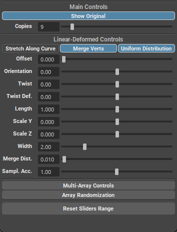

.. currentmodule:: <index>

########################
Linear and Radial Arrays
########################

Intro
^^^^^

**Arraying** is a vital part of any 3D package. It allows for a quick and non-destructive creation of repeating parts and details.

In Maya, arraying is only available through a built-in plug-in package - MASH. Although it is very powerful Motion Graphics tool, MASH is not very friendly to the user when it comes to modeling workflows.

In GS Toolbox there are two types of Arrays with 2 modes each. They utilize MASH in the background, but simplify and streamline the workflow focusing on a modeling side of arraying.

Two types of arrays are:

- **Linear Array** that has 2 modes:

    - **Uniform Linear** array that provides with uniform and non deformable way of copying geometry
    - **Deformed Linear** array that provides with an array that can be deformed using provided controls

- **Radial Array** that has 2 modes:

    - **Uniform Radial** Array that creates a radial pattern without deforming the original geometry
    - **Deformed Radial** Array that creates a radial pattern and deforms the original geometry.

.. note:: Linear arrays can also be applied to already existing curves and will follow their path. It is done by selecting the object(s) and the curve before clicking on any axis button.

.. note:: Due to the way **MASH** and **Python** interact in Maya, if you wish to **undo** an array you have to press **Ctrl+Z** not once, but **a few times** until you return back you your **original object (it should be highlighted)**

Linear-Uniform Array
^^^^^^^^^^^^^^^^^^^^

Linear array creates repeating copies of the selected object in line based on the selected axis (X,Y,Z).

|
|
|
|

.. figure:: images/changing_linear_array_copies.gif
	:class: with-shadow align-right
	:width: 250px
	:align: center

The created array object is fully procedural and you can quickly change the number of the copies by selecting the arrayed mesh and dragging the "Copies" slider or selecting the arrayed mesh and going to the Channel Box for advanced options.

|
|
|
|

Original object that you've arrayed is still there, can be edited using Maya tools and the changes you make will reflect on the arrayed objects.

|
|
|
|
|
|
|

Every linear array you create has a control curve that can be modified and the array will follow that path curve.

You can easily control the array using this curve and even change the shape of that curve to change the path of the array accordingly.

Enabling or disabling the Rotation toggle will change the alignment of the mesh to that path curve. Disabled Rotation toggle will ignore the curve orientation and keep the original orientation of the mesh intact.

Linear-Uniform Array Attributes
^^^^^^^^^^^^^^^^^^^^^^^^^^^^^^^

.. figure:: images/uniform_linear_array_attributes.png
	:class: with-shadow align-right
	:width: 250px
	:align: center

The **basic attributes** you have for the array are:

- **Copies** controls the number of copies in the selected array.
- **Rotation** (Calculate Rotation) enables or disables rotation calculation for the array to follow the control curve.
- **Original** (Show Original) shows or hides the original geometry of the selected array.

The advanced attributes found in the Channel Box:

- **Stretch Along Curve** will determine how much the array should stretch along the length of the curve, where:

    - 0 (zero) is when all the arrayed objects are in the same location at the beginning of the curve.
    - 1 (one) is when all of the arrayed objects are uniformly stretched along the curve with equal spacing.

- **Offset Along Curve** will offset the geometry along the path curve based on the amount

Linear-Deformed Array
^^^^^^^^^^^^^^^^^^^^^

This type of array is very similar to Uniform Linear Array, however it will not try to keep the shape of the original object and will conform to a path curve instead.

|
|
|
|
|
|

.. figure:: images/linear_deformed_array_editing.gif
	:class: with-shadow align-right
	:width: 250px
	:align: center

As with the linear array, original object can easily be edited and the change will propagate forward to the arrayed objects.

You can easily imagine how this can be used to create a massive selection of different objects - pipes, hoses, cables etc.

And everything is procedural!

Linear-Deformed Array Attributes
^^^^^^^^^^^^^^^^^^^^^^^^^^^^^^^^

The basic attributes are the same as the uniform ones - Copies and Original. Rotation is disabled for the deformed array, since it is by default conforming to the curve.

The advanced attributes are:

- Stretch Along Curve will enable or disable uniform stretching of the array along the path curve.
- Offset Along Curve will offset the arrayed geometry along the path curve.
- Orientation allows to rotate the arrayed geometry around the curve.
- Length Scale will change the stretching of the arrayed geometry along the curve.
- Width Scale will change the width of the geometry on the curve.
- Merge Verts will automatically merge verts on the arrayed objects if enabled.
- Merge Distance controls the distance of Merge Verts attribute.
- Uniform Distribution will ignore the overall shape of the object and try to distribute the objects uniformly along the curve
- Sampling Accuracy determines the processing power allocated for the creation of the Deformed Linear Array. If you experience any inconsistencies with the array, or lags, try lowering or raising this number (Default: 1)

Radial-Uniform Array
^^^^^^^^^^^^^^^^^^^^

.. figure:: images/radial_uniform_array.png
	:class: with-shadow align-right
	:width: 250px
	:align: center

This type of array will create a radial pattern of equally spaced arrayed objects without deformation of their shape.

You can change the initial orientation of the array by selecting appropriate axis plane (XY, YZ, ZX).

After that you can still edit the original object and translate, scale and rotate the arrayed object freely.

You can change the number of copies by selecting the arrayed object and dragging the Copies slider.

Radial-Uniform Array Attributes
^^^^^^^^^^^^^^^^^^^^^^^^^^^^^^^

.. figure:: images/radial_uniform_array_attributes.png
	:class: with-shadow align-right
	:width: 250px
	:align: center

- Show Original and Calculate Rotation are similar to the Uniform Linear Array and will simply show/hide original object and enable/disable orientation calculation of the copied array objects.
- Axis can be used to change the axis orientation of the arrayed object.
- Radius changes the radius of the arrayed object.
- ZOffset allows for creation of offset array geometry. The offset will work in a spiral pattern.
- Angle will change the curvature amount of the arrayed object (with 360 being the default and full rotation around the curve)

Radial-Deformed Array
^^^^^^^^^^^^^^^^^^^^^

Deformed Radial Array is a special type of array that will create the radial geometry similar to the Uniform one, but the copies of the original object will now conform and deform to a circle.

|
|
|
|
|
|
|

.. figure:: images/radial_deformed_array_editing.gif
	:class: with-shadow align-right
	:width: 250px
	:align: center

The original object can then be modified and the arrayed object will inherit all of those modifications

This mode can be used as a replacement for a radial mirror that is not currently present in Maya.

The resulting geometry can then be freely transformed, rotated or scaled by the user.

|
|

Radial-Deformed Array Attributes
^^^^^^^^^^^^^^^^^^^^^^^^^^^^^^^^

- Show Original is similar to the Uniform Linear Array and will simply show/hide original object.
- Copies will change the amount of copies you have in your array
- Curvature changes the curvature of the radial array shape where 0 is straight line and negative numbers will flip the shape to the other side (Default: 180)
- Low and High bound controls the curvature of one side of the shape and will "unravel" the shape if both are set to zero.
- Uniform distribution ensures there are no gaps in between array shapes.
- Radius changes the radius of the circular shape.
- Merge and Merge Distance controls the merging of the vertices of the copied array objects.

Arraying Multiple Objects (Multi-Array)
^^^^^^^^^^^^^^^^^^^^^^^^^^^^^^^^^^^^^^^

Linear-Uniform and Radial-Uniform arrays support multi-arraying - arraying different objects in a repeating pattern.

In order to perform a multi-array operation, simply select multiple objects and click on the array axis button (X,Y,Z).

Multi-Array will create a repeating pattern of selected objects that can be controlled using the same methods as other array types.

.. figure:: images/multi_array_attributes.png
	:class: with-shadow align-right
	:width: 250px
	:align: center

Multi-Array has some additional attributes available:

- Pattern will change the pattern of the array. By default this number is equal to the number of unique objects in the multi-array. Raising this number will result in a different pattern.
- Randomize Pattern will randomize the pattern of the multi-array.

.. figure:: images/multi_array_add_subtract.gif
	:class: with-shadow align-right
	:width: 300px
	:align: center

You can Add and Subtract objects from the Multi-Array using + and - buttons available in the array menu.

To add any object to the multi-array, first select the array then select the object you want to add and click on "+" button.

To remove an object from an array simply select the original object (not arrayed copies) and click on the "-" button.

Randomize Arrays
^^^^^^^^^^^^^^^^

.. figure:: images/array_randomization_parameters.png
	:class: with-shadow align-right
	:width: 250px
	:align: center

You can randomize transforms of an array by using Array Randomization parameters available for array objects.

- TX, TY, TZ - Transform X,Y,Z randomization

- RX, RY, RZ - Rotation X,Y,Z randomization

- SX, SY, SZ - Scale X,Y,Z randomization

- Rand Magnitude will change the overall magnitude of randomization.
- Uniform Scale will ensure that the scale is uniform when randomizing SX, SY and SZ scale parameters.

|

Apply Array
^^^^^^^^^^^

In order to apply the selected array, simply select the array in question and click on Apply Array button.

.. warning:: Due to some issues with MASH in Maya 2017-2020+ applying large arrays rarely causes Maya crash to occur. Please save the project before applying large arrays.

