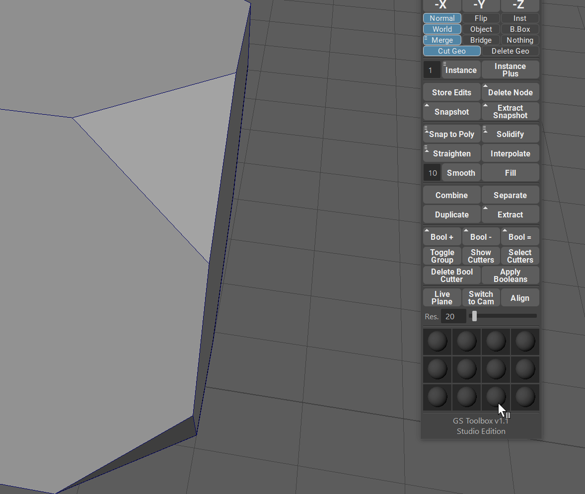
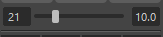
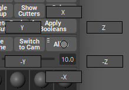

.. currentmodule:: <index>

####################
Live Plane and Align
####################

Live Plane
==========

Live Plane function allows to add a live construction plane that is aligned to the selected polygon.

This is extremely useful if you need to align on or multiple objects (for boolean purposes, for example) to the selected object.

|
|

Grid Resolution
===============

There are two controls available for grid resolution. Slider and input field on the left, and the spacing input field to the right of the slider. Combining these two controls allows for precise spacing and grid resolution control.

Switch to Cam
=============

Each time you create a Live Plane you also create a new camera that follows that plane and aligned to it.

Switch to Cam will switch to that camera.

Align
=====

.. figure:: images/live_plane_align.gif
    :class: align-right
    :width: 250px

Creating geometry on a live plane can cause this geometry to have a wrong rotation and orientation.

Align button will align this new geometry to a Live Plane.

|
|
|
|
|
|

Align Axis
==========

Additional align options are available as a marking menu (hold RMB on Align button) or as a set of hotkeys.

These axes will control which axis of the mesh is aligned to the live plane. This allows for quick orientation control of the aligned mesh.
