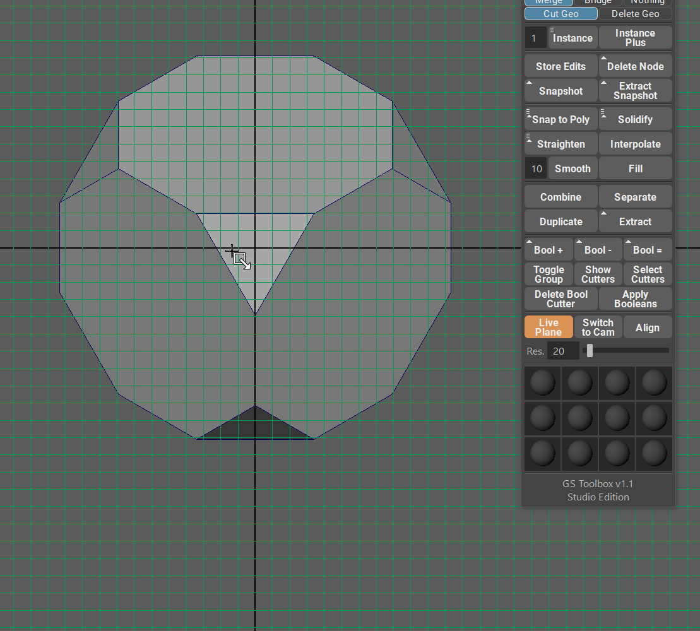

.. currentmodule:: <index>

####################
Live Plane and Align
####################

Live Plane
^^^^^^^^^^

Live Plane function allows to add a live construction plane that is aligned to the selected polygon.

This is extremely useful if you need to align on or multiple objects (for boolean purposes, for example) to the selected object.

|

Switch to Cam
^^^^^^^^^^^^^

Each time you create a Live Plane you also create a new camera that follows that plane and aligned to it.

Switch to Cam will switch to that camera.

Align
^^^^^

Creating geometry on a live plane can cause this geometry to have a wrong rotation and orientation.

Align button will align this new geometry to a Live Plane.
