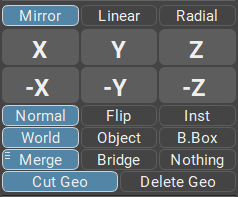
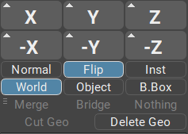
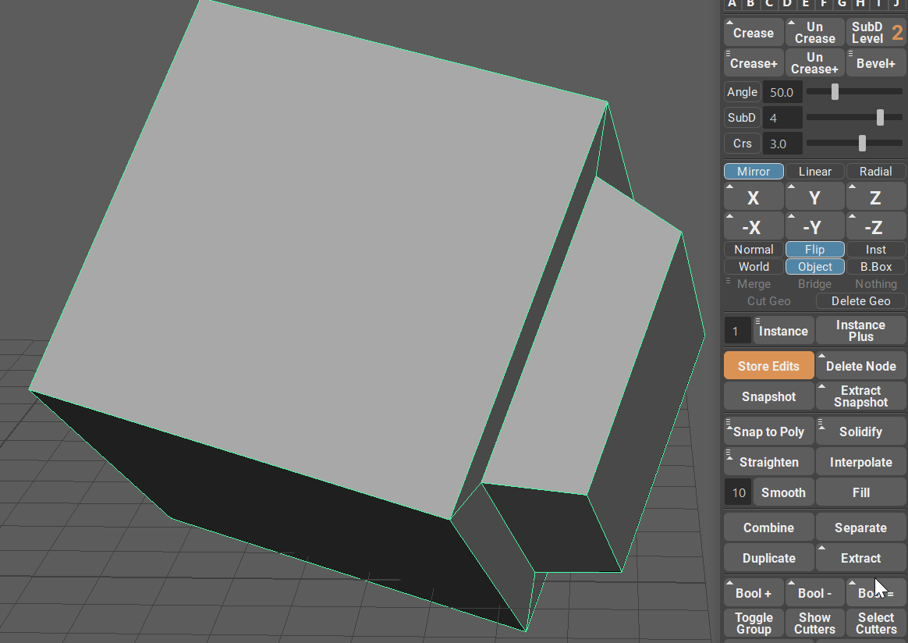
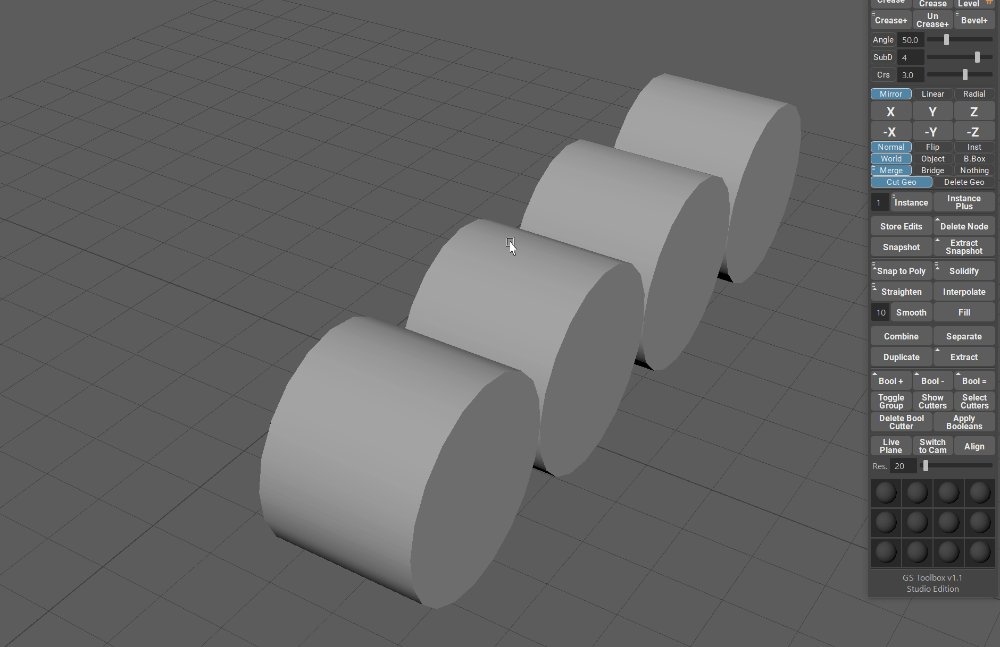
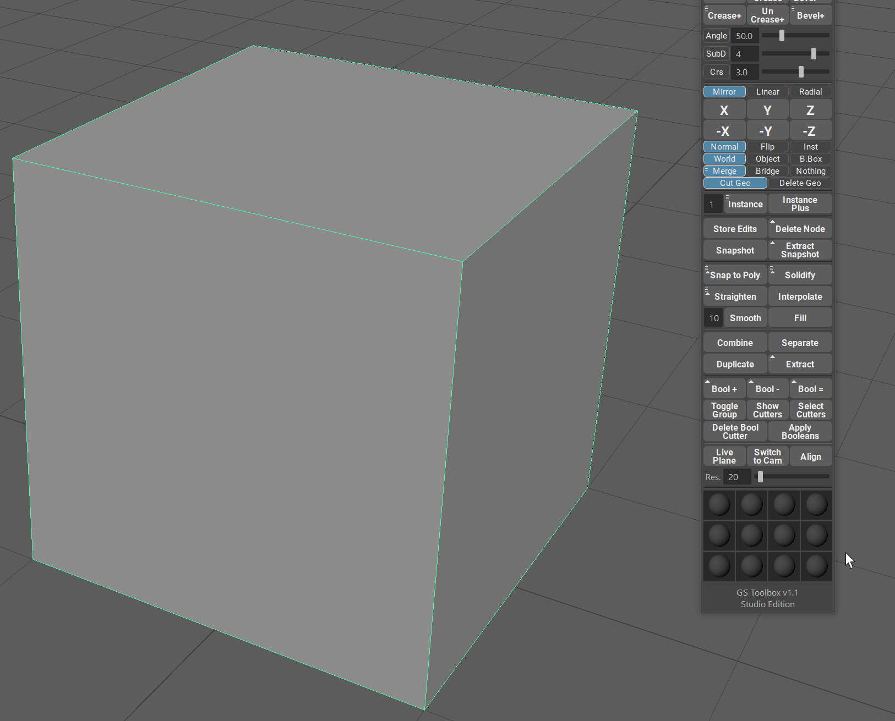

.. currentmodule:: <index>

########################
Mirroring and Instancing
########################

Intro
^^^^^

Mirroring is a very important tool in any 3D package.

Although Maya has its own mirror algorithm and window, the workflow for it requires way to many clicks for simple mirror.
You have to open mirroring window, change parameters, choose axis and if you chose incorrectly and closed the window and undo, you have to repeat the whole process.

GS Toolbox reduces all this work to one button for each axis and some simple switches for all the parameters you need. All in the same window as other tools. All interactive, simple and intuitive.

Mirror and Instance
^^^^^^^^^^^^^^^^^^^

Mirror, Flip and Instance  menu has 6 main buttons - one for each axis.

Simply selecting the object (or multiple objects) and clicking on one of those buttons will perform a mirror, flip or instance operation based on the parameters selected below.

Some parameters will add a small triangle to the top-left corner of the button. That means that this button now has modifier support (Shift) for alternative algorithm and functionality. This will be covered in the mirror parameters section later on this page.

Normal Mirror
^^^^^^^^^^^^^

**Normal** mirror operation mimics the regular Maya mirror operation, but it is streamlined into one click of an axis button.

When using normal mirror you can choose between three mirror axis positions, **World, Object and Bounding Box (B.Box)**, by clicking on the appropriate switch button.

- **World** will position the mirror plane on the 0,0,0 world coordinates.

- **Object** will look at the pivot of an object and position the mirror plane there.

- **Bounding Box (B.Box)** will calculate the bounding box of the object and mirror according to it.

When performing a normal mirror you have four options for how to treat the geometry intersection with the mirror plane.

- **Cut Geo** will toggle the cutting of the geometry if it is intersecting with the mirror plane. Disabling this option will result in a geometry being mirrored but not cut by the mirror plane.

- **Merge** will merge the cut geometry based on the merge tolerance. You can select merge tolerance in the marking menu (Hold RMB) or you can choose Auto merge distance that will estimate merge tolerance based on your mesh.

- **Bridge** will attempt to bridge open borders of your mesh after the mirror operation.

- **Nothing** will do nothing after the mirror operation. It will not merge or bridge, and if you have Cut Geo selected, the resulting mesh will be cut on the mirror plane but vertices will not be merged.

Flip
^^^^

Flip option will simply flip the geometry to the other side of the mirror plane. If the mirror plane happens to be in the middle of the object, it will just flip the left side of the object to the right and vice-versa.

With Flip you can only select the position of the flip axis. It's the same as for the normal mirror - World, Object and Bounding Box.

You might notice a small triangle on the top-right corner of the mirror buttons. This indicates that there are actually two algorithms available for the flip. 

- **Normal Click Flip** - when just clicking the mirror button, the flip algorithm will ignore the orientation of the pivot in Object mode and perorm a flip in a world space coordinates but centered on the pivot point.
- **Shift + Flip** - will perorm a flip in the object mode coordinates, similar to Maya own flip algorithm.

Same algorithm is also available for the **Bounding Box** mode.

Instance
^^^^^^^^

**Instancing with mirroring** can be an extremely powerful tool to mimic the procedural mirror modifiers in other 3D packages. Since Maya does not have procedural mirror (however, GS Toolbox have this covered, look for Instance+), using instance with mirror can help speed up the process of modeling.

It is multi selection compatible, respects other instances and works in one click.

With Instance you can only select the position of the instance axis. It's the same as for the normal mirror - **World, Object and Bounding Box**.

A small triangle that appears in the top-right corner of the axis buttons indicate that there are two algorithms available for this function, similar to the Flip command (read Flip_). Just hold **Shift** to switch to the other algorithm.

Delete Geo
^^^^^^^^^^

By activating **Delete Geo** you will switch to a cutting mode. This mode will cut the geometry based on the mirror axis options and delete the other side.

Same options are available for the position of the axis as for Instance_ and Flip_ commands.
