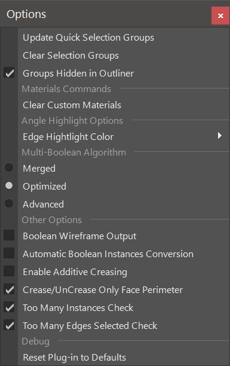

.. currentmodule:: <index>

#######
Options
#######

Options Menu
^^^^^^^^^^^^

Options menu holds all the options available for the functions of GS Toolbox plug-in. You can find it on the top of the menu window.

- **Update Quick Selection Groups** - will update the state of all 20 selection set groups if they happen to not update for some reason. Mostly for debug purposes.
- **Clear Selection Groups** - will remove all the selection groups currently active.
- **Groups Hidden in Outliner** - determines whether the groups from GS Toolbox should be visible in the outliner or not.
- **Clear Custom Materials** - clears all the materials from the Quick Materials menu. It will not delete the materials from the scene.
- **Edge Highlight Color** - selects a highlight color for the Select by Angle function.
- **Multi-Boolean Algorithm** - see :ref:`booleans-algorithms-ref`.
- **Boolean Wireframe Output** - see :ref:`booleans-algorithms-ref` -> Other Options.
- **Automatic Boolean Instances Conversion** - see :ref:`booleans-algorithms-ref` -> Other Options.
- **Store Applied Booleans in a Separate Group** - will store the applied booleans in a separate group in an outliner.
- **Enable Additive Creasing** - when checked Crease Plus will not creases on the entire mesh and instead only replace those crease that math the angle tolerance. Disabling will remove all creases from the mesh that does not match the selected angle tolerance.
- **Crease/UnCrease Only Face Perimeter** - this option will determine whether the Crease function should crease all the edges in the selected face or only the perimeter. This behavior is inverted when holding Shift button.
- **Too Many Instances and Too Many Edges** - whether to show the warning dialogs when either too many instances are being created or too many edges are being selected for some functions.
- **Reset Plug-in to Defaults** - will reset all the settings and the plug-in to the default state.