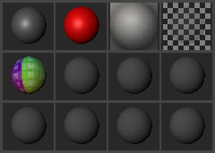
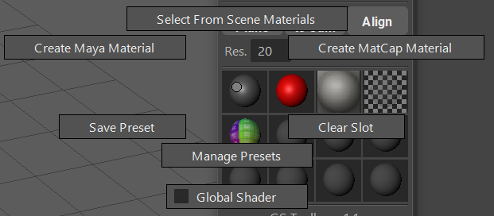
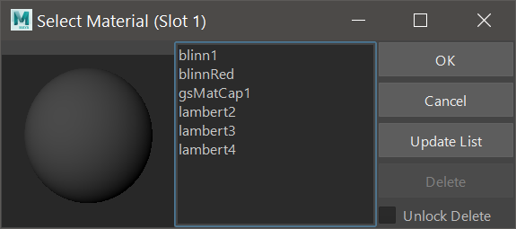
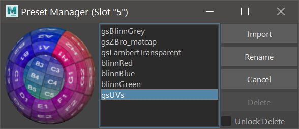

.. currentmodule:: <index>

###############
Quick Materials
###############

Intro
=====

Maya has a powerful node editor for editing materials and shaders - Hypershade.

Although it is extremely flexible and customizable, it is rather slow to use if you only need a few simple materials in your scene.

GS Toolbox adds 12 quick material swatches that you can use to quickly create, apply and store materials. 

Materials can be stored as presets that can then be accessed from any other scene.

Materials Menu
==============

The visible part of the Quick Materials system is the Materials Menu.

Here you have 12 swatches that can be filled with custom materials.

Clicking with LMB on a filled material slot will apply this material to any selected object(s)

Holding RMB on the material slot will open its Marking Menu

Materials Marking Menu
======================

Each of the 12 material slots have its own unique set of functions, hidden in the marking menu (Hold RMB on any slot).

Those function are:

- **Create Maya Material** - this function opens a window of supported Maya materials and clicking on any of those materials will create a new material and place it in the corresponding material slot.

- **Create MatCap Material** - this function opens an "Open File" window where you need to navigate and open a MatCap material image. This new MatCap material will then be placed in the corresponding slot. You can find plenty of MatCap images on the internet.

- **Select From Scene Materials** - will open a window that lists all of the supported materials currently available in the scene. Selecting a material and clicking "Ok" will put the selected material in the corresponding material slot. Update List will update the list of materials in the scene. Unlock Delete + Delete will delete the selected material from the scene.

- **Clear Slot** will simply remove the material from this slot. The material itself will not be deleted.

- **Save Preset** will open a "Name Your Preset" dialog where you can enter the name of the preset and save it for later use.

- **Manage Presets** will open a preset manager window where you can Import, Rename and Delete Presets. Import will import the saved material and put it into the corresponding slot.
