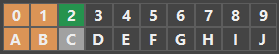
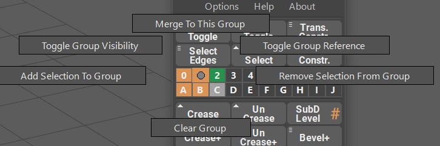
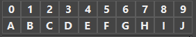
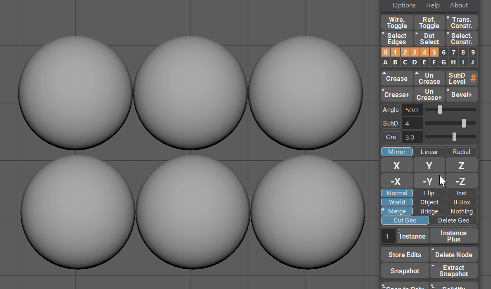
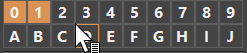
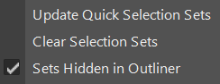

.. currentmodule:: <index>

################
Selection Groups
################

Intro
=====

Selection groups menu is a powerful and easy to use tool that allows for a quick storing of the user selection, hiding objects and components and disabling selectability of objects in the viewport.

Each of the 20 selection groups have its own marking menu (Hold RMB on one of the selection groups) that allows for various functions.

Adding and Selecting
====================

In order to **add objects or components** to the selection set, all you need to do is to **select those objects or components** and **click on an empty selection set**. The set will then change its color to indicate that it has something in it.

**Clicking with LMB** on a filled selection set will now select the objects or components that were added to that set.

**Shift + LMB** on multiple filled selection groups will additively select everything in those selection groups.

|

Quick Actions and Boolean Logic (Drag and Drop)
===============================================

You can use modifier key combinations to add, subtract or intersect either two selection sets or selection set and a viewport selection.

Simply select something in a viewport and hold these keys (or drag and drop one selection set onto another):

- **Shift + Ctrl** - will add selection to the target non-empty selection set or it will merge two selection sets if dragging and dropping one onto another using Middle Mouse Button.

- **Shift + Alt** - will subtract selection from the target non-empty selection set or it will subtract two selection sets if dragging and dropping one onto another using Middle Mouse Button.

- **Ctrl + Alt** - will intersect selection with the target non-empty selection set or it will intersect two selection sets if dragging and dropping one onto another using Middle Mouse Button.

Color coordination
==================

Based on the color of the group you can quickly determine the state of the group.

- **Transparent** - empty group
- **Orange** - group is filled with something
- **Green** - group is currently in Reference Mode and not selectable in the viewport
- **Light Gray** - group is currently hidden in the viewport

Selection Groups Marking Menu
=============================

To access the marking menu simply **Hold RMB** on the selection set button. Now you can move the selection line to any of the buttons and release the to apply the function.

Available functions:

- **Clear Group** will clear the selected group without deleting any objects or components.
- **Add and Remove Selection to/from the Group** will add/remove selected objects from the Group.
- **Toggle Group Visibility** will toggle viewport visibility of the grouped objects or components.
- **Toggle Group Reference** will toggle the selectability of the grouped objects. Not compatible with components.
- **Merge To This Group** will add the selection to this group and remove the selection from any other groups.

Options
=======

In the options menu you can quickly update selection Groups (if they are not updated for some reason), clear all selection Groups and set Groups Hidden in Outliner (Default: Enabled)
