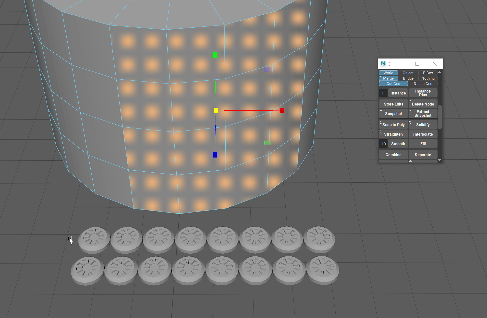
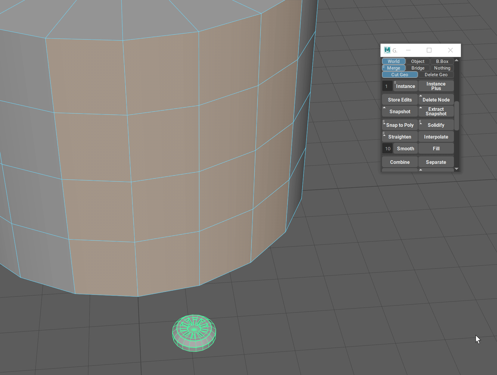

.. currentmodule:: <index>

############
Snap to Poly
############

Intro
^^^^^

Sometimes it is necessary to quickly populate some surface with details and it is very tiresome to use something like "Snap Together" tool from native Maya. Bolts, surface details for booleans, pipe details and much more.

Snap to Poly function was created for this exact purpose and in conjunction with Randomize Transforms (from :ref:`instance-page`) it can be a powerful detailing and modeling tool.

You can change the behaviour of Snap to Poly by accessing its marking menu (Hold RMB on the button)

Snap to Poly - Simple Snap
^^^^^^^^^^^^^^^^^^^^^^^^^^

Snap to Poly function by default will simply snap any number of objects to any number of selected faces on one object. 

This function will snap and orient the objects based on their pivot and the normal component of the polygon selected.

You can select any combination of faces and objects and if, for example, number of faces do not match the number of faces, Snap to Poly will simply snap as many objects as it can.

To ease the selection process select the faces first, and then the objects in question. After that just click on Snap to Poly.

Snap to Poly - Instance and Snap
^^^^^^^^^^^^^^^^^^^^^^^^^^^^^^^^

Instance and Snap is option in the marking menu (Hold RMB on the button) is useful when you need to instantiate a single object over a large number of faces (bolts, nuts or other surface details).

Just select the faces that you need and with this option enabled select only one object. After that you can simply click on Snap to Poly.

This will create procedural instances of the object so you can edit the original and see all the edits propagate to the instances.

Snap to Poly - Pre-Duplication
^^^^^^^^^^^^^^^^^^^^^^^^^^^^^^

Pre-Duplication option (Hold RMB on the button) if enabled will always leave one unique object behind for the edit purposes.

