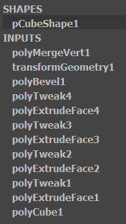
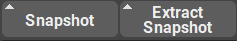

.. currentmodule:: <index>

#########
Snapshots
#########

Intro
^^^^^

In Maya each edit of the geometry is stored within a node that is added to so called Construction History that you see as a column of entries in the Channel Box or as tabs in Attribute Editor. You can even edit some of the settings on those nodes procedurally, with caution.

The downside of this procedural behavior is that each additional node added to the Construction History will gradually slow down the responsiveness of Maya. Some nodes do this more than others. For example, polyBevel is very "heavy".

The usual workaround for this is to select an object with Construction History and apply Edit -> Delete by Type -> History. This will remove all the history nodes from the object and apply them to it.

Although this works, sometimes you want to store the previous state of the object to be able to return to it later.

This is where "Snapshot" comes into play.

Snapshot
^^^^^^^^

Snapshot button will store a duplicate of an object with the exact state of Construction History it has into a separate group with the name "(object_name)_sn". You can store multiple snapshots this way, with different history for each snapshot.

Storing a snapshot will not alter the original object by default. Its history will remain intact. 

However, you can quickly remove the history after the snapshot was created by simply holding Shift button before you click on the "Snapshot" button.

The snapshot group and the objects in it will follow the original object when you transform, scale or rotate it.

.. note:: Be aware that by scaling the original object non-uniformly, you will also scale all the snapshots it has.

Extract Snapshot
^^^^^^^^^^^^^^^^

Extract Snapshot button will extract any selected snapshot from the snapshot group and clean it up for further use. 

Extract Snapshot will not remove the snapshot from the group by default, it will just duplicate and unparent it.

You can hold Shift when clicking on Snapshot to actually delete the snapshot from the snapshot group. The snapshot group itself will be deleted if the last object in it was deleted.