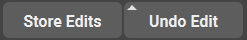

.. currentmodule:: <index>

###########################
Store Edits and Undo Edit
###########################

Intro
=====

The main concept of editing geometry in Maya is by using so called Construction History and Nodes it represents.

Construction history is nothing more than a bunch of nodes connected together in a (mostly) linear fashion.

When you, for example, apply a polySplit command (using Multi-Cut tool) you can notice that in the Channel Box there is a new entry in the INPUTS section - polyCut. 

This means that Maya simply added this polyCut node at the top of the node chain of the object.

Almost all of the functions add a new node to the construction history of an object.

Since this node chain is linear, it can be reversed to return the object to its previous state.

Unfortunately it is very inconvenient to do natively in Maya.

GS Toolbox adds Store Edits and Undo Edit button exactly for this purpose - storing and reversing edits on the objects in one click.

Store Edits
===========

Store Edits button stores vertex transforms of the mesh.

Not all of the changes the user make to the mesh are stored in the nodes by default. Some of them (vertex transformations) are stored in the shape node and can cause unexpected behavior if user then tries to reverse the history of an object without those edits applied as a node.

Store Edits button ensures that the mesh is always initialized to the state that is compatible with the "Undo Edit" and it also serves another purpose - staging the vertex edits of the geometry.

**Uninitialized Edits**

Whenever used sees the white outline around Store Edits button, it means that the selected mesh is not properly initialized for the vert edits to be stored. It is very easy to fix, simply click on the Store Edits button whenever you see uninitialized objects and it will automatically fix everything.

**Staging Vert Edits**

If you have your mesh initialized, you can then perform any vert edit (move vertices, edges and faces) and then stage those edits by clicking on a Store Edits button. Orange color on the button but without white outline indicates that there are some edits that can be staged/stored on the selected mesh. Simply clicking on the button will store those edits in a node and the button will then return back to neutral state.

Staging your vert edits (poly edits) is very useful if you are experimenting with different shapes of the mesh and you wish to return back to the previous iteration. Simply click on the Store Edits after each significant change and those changes can then be reversed using Undo Edit button.

Undo Edit
=========

Undo Edit (prev. Delete Node) button is a simple way to reverse the construction history of an object (given that this history was not deleted).

To start reversing the history, simply click on the Undo Edit and it will step-by-step reverse the Construction History nodes back to the original shape.

.. note:: It is not necessary to use "Store Edits" button every time if the mesh is already initialized (no white outline on the button). Simply clicking on the Undo Edit will automatically apply latest vert edit and reverse it.

.. note:: Note that sometimes edits of the geometry are not visible and multiple clicks on the Undo Edit are required to reverse the edit.

Selecting a Node in the Channel Box, holding Shift and clicking on the Undo Edit will result in the deletion of that exact node.

.. warning:: Deleting selected history nodes out of order can result in an unexpected behavior.
