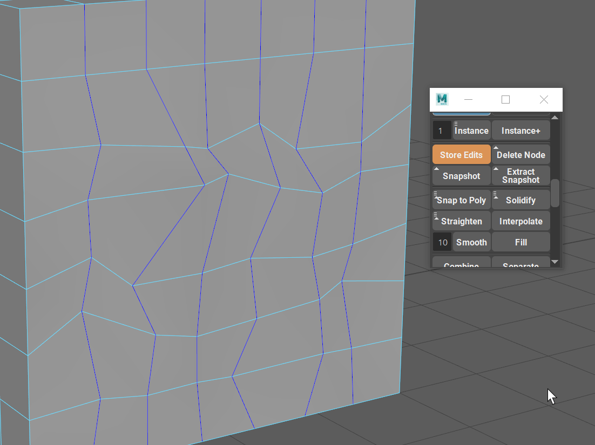
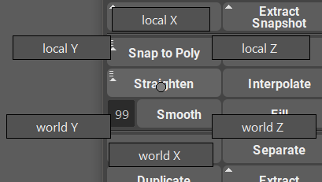
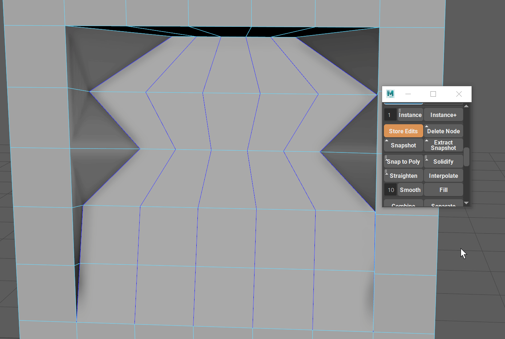
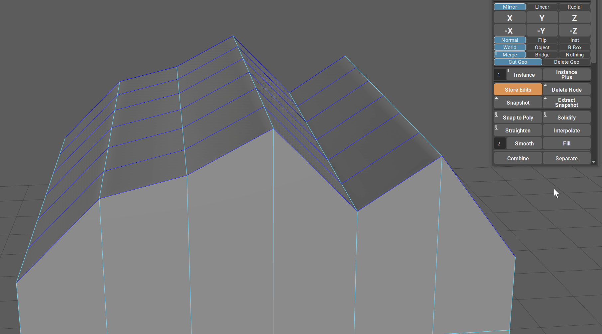

.. currentmodule:: <index>

##################################
Straighten, Interpolate and Smooth
##################################

Intro
^^^^^

When going deep into the poly modeling and adding hard surface details, it is sometimes important to redirect the flow of vertecies and edges.

Im Maya, the only "automatic" way to do so is to use "Edit Edge Flow" feature. Although powerful in its own way, it is not that useful when you have hard surface object and you just want a straight line between two verts, or smooth rounded transition between 3 vertecies.

This is where **Straighten, Interpolate and Smooth** functions come in.

Straighten
^^^^^^^^^^

Straightening an edge is a very simple concept, however even this simple function is not available in Maya natively.

**Straighten button** will straighten the edge selection (or multiple **edge groups**) between their first and last vertex. 

|
|

.. note:: **Edge groups** are just unconnected edges.

**Selection order does not matter** for **Straighten** function. You can select one **edge group** or multiple **edge groups** and use Straighten function only once to straighten all of them.

Notice how in the example gif, first straighten click only projects the vertecies on a straight line between the first and the last vert in an edge group. **This is the default behavior** of Straighten without any modifiers.

If you hold **Shift + Straighten**, it will equalize the positions of the vertices along this straight line. This is showed in the second click on the GIF.

Straighten - Marking Menu
^^^^^^^^^^^^^^^^^^^^^^^^^

You can access the Straighten Marking Menu by holding RMB on the Straighten button.

In this menu you will find Local and World axis buttons.

Those buttons represent the axis to which the selected edge group should be flatten to.

Local will work as if you are trying to zero the scale (using scale gizmo) in the component mode.

World will work as if you are trying to zero the scale (using scale gizmo) in the world space mode.

Interpolate
^^^^^^^^^^^

Interpolate will smoothly interpolate the selected edge groups based on three points - first, middle, and last vert.

If there is no middle vert (odd number of edges selected) Interpolate will average between two nearest "middle" edges.

Interpolate will create a natural curve based on the vertices of the selected edges.

If you wish to change the shape of that curve, simply move first, middle or last vert of the edge selection.

.. note:: Unline Straighten, Interpolate will not project verts and just equalize them instead.

Smooth
^^^^^^

Smoothing is as simple way to smooth edges in the selected edge groups. 

Smooth will average vertices in the selected edge group based on the smoothing multiplier (number on the left of the Smooth button).

Multiplier has a range from 1 to 99 where 1 is the smallest amount of smoothing and 99 is maximum smoothing.

If you repeat smooth command enough times, the edge selection will eventually turn into a straight line.