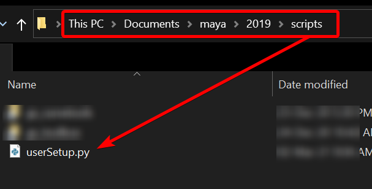
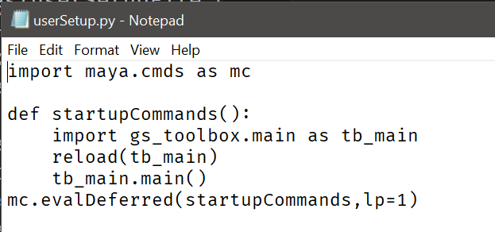

.. currentmodule:: <index>

###########
Useful tips
###########

Automatic startup of the plug-in
^^^^^^^^^^^^^^^^^^^^^^^^^^^^^^^^

In order to automatically start the plug-in during Maya startup you need to modify (or add) **userSetup.py** file in your scripts folder.

**Instructions:**

- You need to create **userSetup.py** file in your Maya scripts folder.
  
- Use the correct folder for your version of Maya.
  
- For example, **for Maya 2019** this file should be in (\\Documents\\maya\\2019\\scripts)
  
- Just create an empty text file called **userSetup.txt**, paste the code there and rename the file to **userSetup.py**.

- If you already have this file in the folder, open it with any text editor and paste the code at the bottom of the file.

|
|

**Code to paste to userSetup.py file:**

.. code:: python

    import maya.cmds as mc

    def startupCommands():
        import gs_toolbox.main as tb_main
        from imp import reload
        reload(tb_main)
        tb_main.main()
    mc.evalDeferred(startupCommands,lp=1)

You can also download the userSetup.py file here: userSetup.py_

.. _userSetup.py: https://gist.github.com/Video-Nomad/12444a37ab8e5a2ac35cc5c62e97a72d